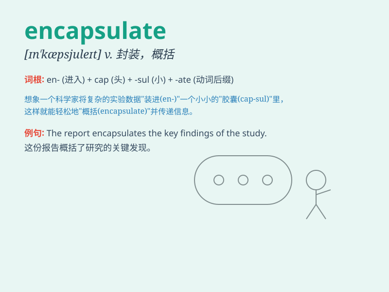

## encapsulate

**英音:** _[ɪn\'kæpsjʊleɪt; en-]_ **美音:**
_[ɪn\'kæpsjə\'let]_

**译义:** *vt.装入胶囊,压缩vi.形成胶囊*

### 短语

+ **encapsulate an idea:** _概括一个想法_

+ **encapsulate the essence:** _概括本质_

+ **encapsulate a story:** _概括一个故事_

+ **encapsulate the experience:** _总结经验_

+ **encapsulate a theory:** _概括一个理论_

### 例句

#### 例句1

> **The report encapsulates the results of the research project.**

**中文翻译:** 这份报告概括了研究项目的成果。

**单词释义:** 概括

#### 例句2

> **This story encapsulates the essence of true friendship.**

**中文翻译:** 这个故事体现了真正友谊的本质。

**单词释义:** 体现

#### 例句3

> **The law encapsulates the rights and duties of citizens.**

**中文翻译:** 该法律涵盖了公民的权利和义务。

**单词释义:** 涵盖

### 背诵小故事

> Imagine a scientist trying to protect a precious chemical formula. He
puts it into a special capsule. This act of putting something precious
into a capsule is like \'encapsulate\'.

**想象一位科学家试图保护一个珍贵的化学配方。他把它放进一个特殊的胶囊里。这种把珍贵的东西放进胶囊的行为就像是'encapsulate（封装，概括）'。**

### 图义

