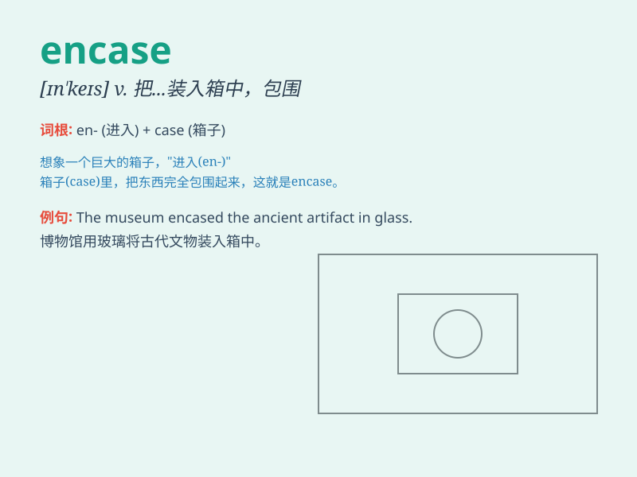

## encase

**英音:** _[ɪn\'keɪs; en-]_ **美音:** _[ɪn\'kes]_

**译义:** *vt.装入,包住,围*

### 短语

+ **encase in:** _把...装入，把...围住_

+ **encase with:** _用...包住_

+ **be encased:** _被包住，被围住_

+ **encase something carefully:** _小心地把某物包住_

+ **encase oneself:** _把自己包裹起来_

### 例句

#### 例句1

> **The precious artifact was encased in a glass display box for
protection.**

**中文翻译:** 这件珍贵的文物被装在一个玻璃展示盒里以作保护。

**单词释义:** 把\...装入，包住

#### 例句2

> **The statue was encased in a thick layer of ice.**

**中文翻译:** 这座雕像被包裹在一层厚厚的冰里。

**单词释义:** 把\...围住，围住

#### 例句3

> **The book was encased in a beautiful leather cover.**

**中文翻译:** 这本书被装在一个漂亮的皮套里。

**单词释义:** 把\...装进（套子等）

### 背诵小故事

> A brave knight was on a dangerous mission. To protect his precious
map, he encased it in a metal box. The box ensured the map was safe from
any harm. So, encase means to enclose or cover something for protection.

**一位勇敢的骑士正在执行一项危险的任务。为了保护他珍贵的地图，他把它装进了一个金属盒子里。这个盒子确保了地图不受任何伤害。所以，encase
意思是把某物包住或盖住以进行保护。**

### 图义

