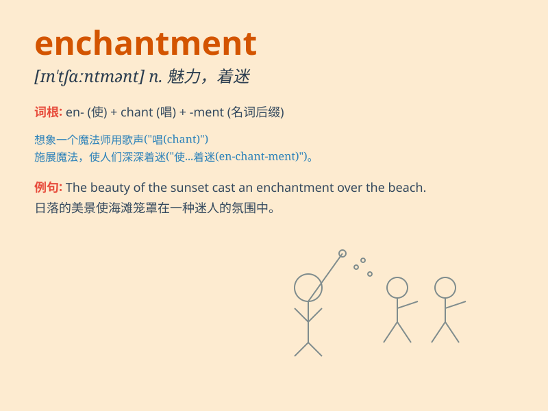

## enchantment

**英音:** _[ɪn\'tʃɑːntm(ə)nt]_ **美音:**
_[ɪn\'tʃæntm(ə)nt]_

**译义:** *n.迷惑,着迷,魔法,妖术,魅力*

### 短语

+ **under an enchantment:** _被施魔法；中了魔法_

+ **cast an enchantment:** _施魔法；施展魔力_

+ **break the enchantment:** _破除魔法；解除魔力_

+ **enchantment spell:** _魔法咒语_

+ **power of enchantment:** _魔力；迷人的力量_

### 例句

#### 例句1

> **The garden was filled with an enchanting fragrance.**

**中文翻译:** 花园里充满了迷人的香气。

**单词释义:** 迷人；魅力

#### 例句2

> **The story held the children under its enchantment.**

**中文翻译:** 这个故事使孩子们着了迷。

**单词释义:** 着迷；陶醉

#### 例句3

> **The beauty of the landscape was an enchantment to all who saw
it.**

**中文翻译:** 这片风景的美丽令所有看到的人陶醉。

**单词释义:** 陶醉；魅力

### 背诵小故事

> A young wizard discovered a hidden cave filled with mysterious
crystals. When he touched them, a powerful force of enchantment
surrounded him, making him feel like he could do anything magical.

**一位年轻的巫师发现了一个隐藏的洞穴，里面充满了神秘的水晶。当他触摸它们时，一股强大的魔力围绕着他，让他觉得自己可以施展任何魔法。**

### 图义

