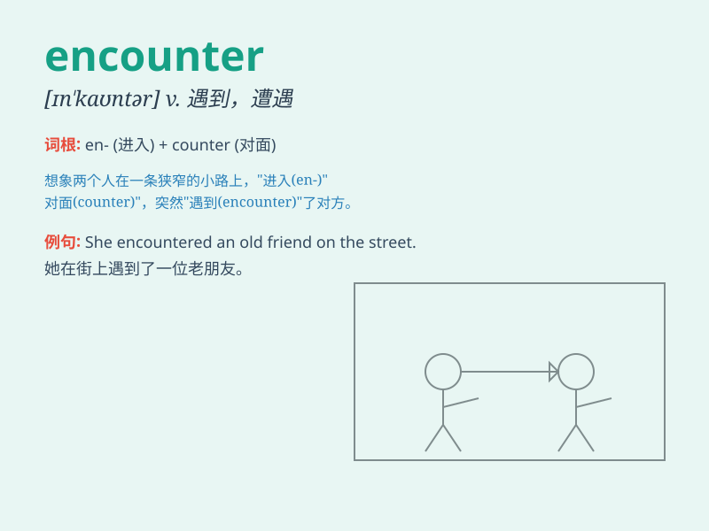

## encounter

**英音:** _[ɪn\'kaʊntə; en-]_ **美音:** _[ɪn\'kaʊntɚ]_

**译义:** *v.遭遇,遇到,相遇n.遭遇,遭遇战*

### 短语

+ **encounter difficulties:** _遇到困难_

+ **encounter problems:** _碰到问题_

+ **encounter an enemy:** _遭遇敌人_

+ **chance encounter:** _偶然相遇_

+ **unexpected encounter:** _意外的相遇_

### 例句

#### 例句1

> **I encountered a problem while doing my homework.**

**中文翻译:** 我在做作业时遇到了一个问题。

**单词释义:** 遇到，碰到

#### 例句2

> **They encountered strong resistance during the military
operation.**

**中文翻译:** 他们在军事行动中遭遇了强烈的抵抗。

**单词释义:** 遭遇，碰到

#### 例句3

> **The hiker encountered a beautiful waterfall in the forest.**

**中文翻译:** 这位徒步旅行者在森林里邂逅了一处美丽的瀑布。

**单词释义:** 邂逅，偶然碰到

### 背诵小故事

> One day, while hiking in the forest, I encountered a wild bear. I was
so scared but managed to stay calm and slowly back away. The unexpected
encounter made me realize the importance of being prepared for surprises
in life.

**有一天，在森林里徒步时，我遇到了一只野熊。我非常害怕，但设法保持冷静，慢慢后退。这次意外的遭遇让我意识到为生活中的意外做好准备的重要性。**

### 图义

