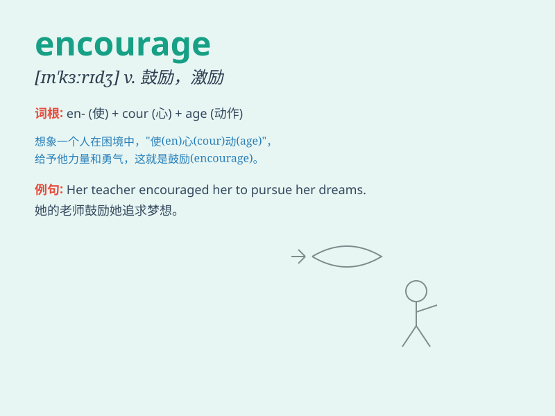

## encourage

**英音:** _[ɪn\'kʌrɪdʒ; en-]_ **美音:** _[ɪn\'kɝrɪdʒ]_

**译义:** *vt.鼓励,怂恿v.鼓励,鼓励*

### 短语

+ **encourage sb to do sth:** _鼓励某人做某事_

+ **encourage in:** _在\...方面鼓励_

+ **encourage by:** _通过\...鼓励_

+ **encourage with:** _用\...鼓励_

+ **give encouragement to:** _给\...鼓励_

### 例句

#### 例句1

> **My parents always encourage me to study hard.**

**中文翻译:** 我的父母总是鼓励我努力学习。

**单词释义:** 鼓励

#### 例句2

> **The teacher\'s praise encouraged the students to do better.**

**中文翻译:** 老师的表扬鼓励学生们做得更好。

**单词释义:** 激励

#### 例句3

> **We should encourage innovation in our company.**

**中文翻译:** 我们应该在公司鼓励创新。

**单词释义:** 提倡；促进

### 背诵小故事

> Once upon a time, a little bird was afraid to fly high. But its
friend constantly gave it praise and support, which encouraged the
little bird to take the leap. Finally, the bird soared freely in the
sky.

**从前，一只小鸟害怕飞得高。但它的朋友不断地给它称赞和支持，这鼓励了小鸟勇敢一跃。最终，小鸟在天空中自由翱翔。**

### 图义

