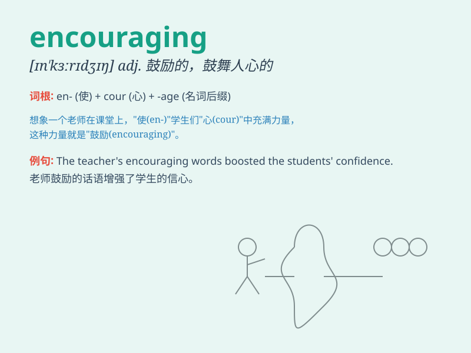

## encouraging

**英音:** _[eŋ\'kʌrɪdʒɪŋ]_ **美音:** _[ɪn\'kɝɪdʒɪŋ]_

**译义:** *adj.奖励的,可奖励的*

### 短语

+ **encouraging words:** _鼓励的话语_

+ **encouraging result:** _令人鼓舞的结果_

+ **encouraging sign:** _令人鼓舞的迹象_

+ **encouraging progress:** _鼓舞人心的进展_

+ **encouraging smile:** _鼓励的微笑_

### 例句

#### 例句1

> **The encouraging news lifted our spirits.**

**中文翻译:** 这个令人鼓舞的消息使我们精神振奋。

**单词释义:** 令人鼓舞的

#### 例句2

> **Her encouraging words gave me the confidence to keep going.**

**中文翻译:** 她鼓励的话语给了我继续前进的信心。

**单词释义:** 鼓励的

#### 例句3

> **The coach\'s encouraging smile made the athlete perform
better.**

**中文翻译:** 教练鼓励的微笑让运动员表现得更好。

**单词释义:** 鼓励的；鼓舞人心的

### 背诵小故事

> A student was very nervous before the exam. The teacher gave an
encouraging smile and said, \'You can do it!\' The student felt
confident and did well. Encouraging means giving someone support and
confidence.

**一名学生在考试前非常紧张。老师给了一个鼓励的微笑并说：'你能行！'学生感到自信并且考得很好。encouraging
意思是给某人支持和信心。**

### 图义

