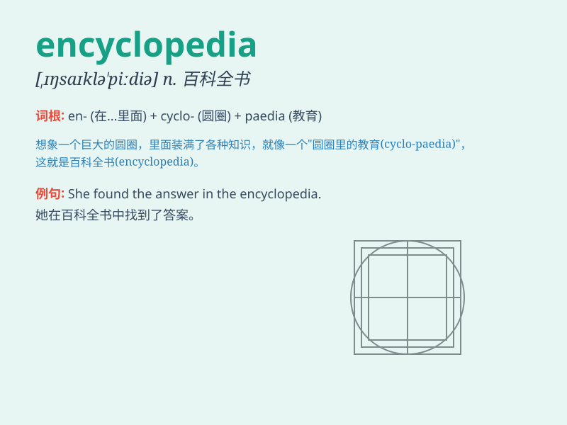

## encyclopedia

**英音:** _[ɪnˌsaɪkləˈpiːdiə]_ **美音:**
_[ɪnˌsaɪkləˈpidiɚ]_

**译义:** *n.百科全书*

### 短语

+ **encyclopedia britannica:** _《大英百科全书》_

+ **medical encyclopedia:** _医学百科全书_

+ **encyclopedia of history:** _历史百科全书_

+ **encyclopedia of science:** _科学百科全书_

+ **encyclopedia of art:** _艺术百科全书_

### 例句

#### 例句1

> **I often refer to the encyclopedia when I have questions about
history.**

**中文翻译:** 当我有关于历史的问题时，我经常查阅百科全书。

**单词释义:** 百科全书

#### 例句2

> **The library has a large collection of encyclopedias.**

**中文翻译:** 图书馆有大量的百科全书收藏。

**单词释义:** 百科全书

#### 例句3

> **She spent hours reading the encyclopedia to learn about different
cultures.**

**中文翻译:** 她花了几个小时阅读百科全书来了解不同的文化。

**单词释义:** 百科全书

### 背诵小故事

> Once upon a time, a curious child wanted to know everything. So, a
wise elder gave him an \'encyclopedia\' as a key to unlock the world\'s
knowledge. With it, the child could explore all kinds of subjects and
satisfy his curiosity.

**从前，有一个好奇的孩子想知道一切。于是，一位睿智的长者给了他一本"百科全书"作为开启世界知识的钥匙。有了它，孩子可以探索各种学科并满足他的好奇心。**

### 图义

