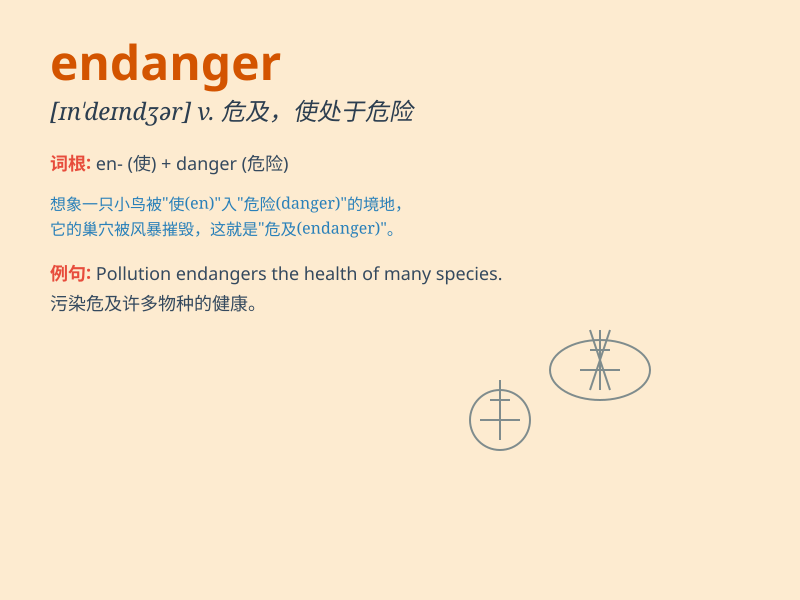

## endanger

**英音:** _[ɪn\'deɪn(d)ʒə; en-]_ **美音:**
_[ɪn\'dendʒɚ]_

**译义:** *vt.危及*

### 短语

+ **endanger oneself:** _使自己处于危险之中_

+ **endanger species:** _危及物种_

+ **endanger health:** _危害健康_

+ **endanger safety:** _危及安全_

+ **endanger the environment:** _危害环境_

### 例句

#### 例句1

> **The illegal hunting of wild animals endangers their survival.**

**中文翻译:** 非法捕猎野生动物危及它们的生存。

**单词释义:** 危及

#### 例句2

> **Pollution seriously endangers the health of local residents.**

**中文翻译:** 污染严重危及当地居民的健康。

**单词释义:** 危害

#### 例句3

> **His actions endanger the safety of the entire team.**

**中文翻译:** 他的行为危及整个团队的安全。

**单词释义:** 使处于危险之中

### 背诵小故事

> A brave explorer was in a deep forest. He accidentally stepped on a
rare plant, not knowing it was endangered. When he learned the truth, he
felt very sorry and decided to protect such precious species.

**一位勇敢的探险家在一片幽深的森林里。他不小心踩到了一株稀有的植物，当时并不知道它处于濒危状态。当他了解真相后，感到非常抱歉，并决定保护这类珍贵的物种。**

### 图义

