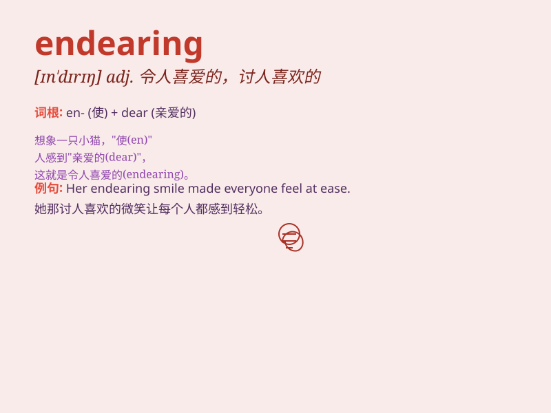

## endearing

**英音:** _[ɪn\'dɪərɪŋ; en-]_ **美音:** _[ɪn\'dɪrɪŋ]_

**译义:** *adj.引起爱情的,可爱的,令人钟爱的*

### 短语

+ **endearing smile:** _迷人的微笑_

+ **endearing personality:** _讨人喜欢的性格_

+ **endearing charm:** _可爱的魅力_

+ **endearing manner:** _亲切的态度_

+ **endearing quality:** _讨人喜欢的品质_

### 例句

#### 例句1

> **Her endearing smile always brightens up the room.**

**中文翻译:** 她那迷人的微笑总是能让房间亮起来。

**单词释义:** 迷人的

#### 例句2

> **The puppy\'s endearing antics made us all laugh.**

**中文翻译:** 小狗可爱的滑稽动作让我们都笑了。

**单词释义:** 可爱的

#### 例句3

> **His endearing personality makes him very popular among his
friends.**

**中文翻译:** 他讨人喜欢的性格使他在朋友中很受欢迎。

**单词释义:** 讨人喜欢的

### 背诵小故事

> A little puppy was always following its owner around, its innocent
eyes and wagging tail were so endearing. The owner couldn\'t help but
love it deeply. The puppy\'s charm made the owner feel warm and happy.

**一只小狗总是跟着它的主人到处跑，它天真的眼睛和摇摆的尾巴十分惹人喜爱。主人情不自禁深深地喜欢上了它。小狗的魅力让主人感到温暖和快乐。**

### 图义

