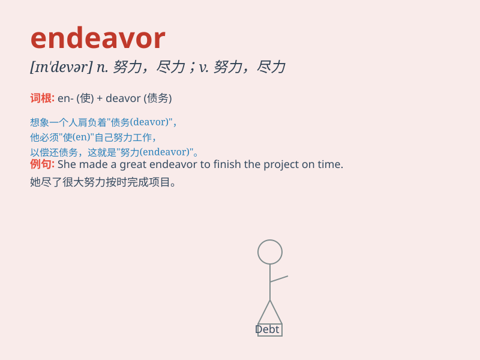

## endeavor

**英音:** _[ɪn\'devə]_ **美音:** _[ɪn\'dɛvɚ]_

**译义:** *n.努力,尽力vi.尽力,努力*

### 短语

+ **make an endeavor:** _努力；尽力_

+ **in an endeavor to:** _为了；企图_

+ **endeavor after:** _追求；争取_

+ **endeavor to do sth:** _努力做某事_

+ **spare no endeavor:** _不遗余力；全力以赴_

### 例句

#### 例句1

> **He made every endeavor to find a job.**

**中文翻译:** 他竭尽全力找工作。

**单词释义:** 努力；尽力

#### 例句2

> **The team\'s endeavor to win the championship was highly
commendable.**

**中文翻译:** 这个团队为赢得冠军所做的努力非常值得称赞。

**单词释义:** 努力；尝试

#### 例句3

> **We should endeavor to improve our skills.**

**中文翻译:** 我们应该努力提高我们的技能。

**单词释义:** 努力；尽力

### 背诵小故事

> A brave astronaut endeavored to explore a mysterious planet. Despite
many difficulties, he never gave up. His strong will and effort made his
endeavor successful.

**一位勇敢的宇航员努力去探索一颗神秘的行星。尽管困难重重，他从未放弃。他坚强的意志和努力使他的努力获得了成功。**

### 图义

