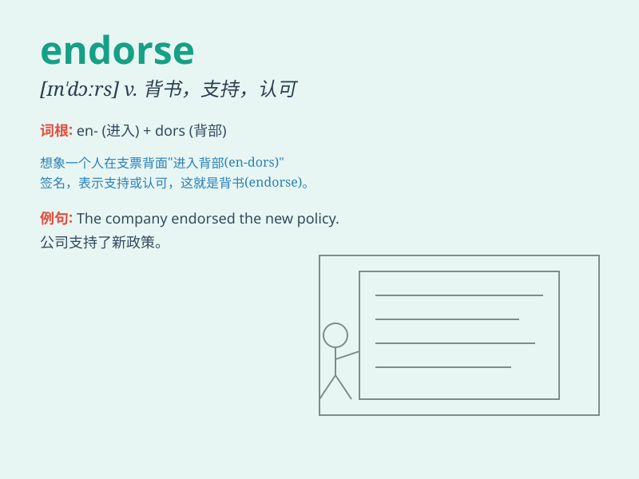

## endorse

**英音:** _[ɪn\'dɔːs; en-]_ **美音:** _[ɪn\'dɔrs]_

**译义:** *v.在(票据)背面签名,签注(文件),认可,签署*

### 短语

+ **endorse a cheque:** _在支票上背书_

+ **endorse a candidate:** _支持候选人_

+ **endorse an opinion:** _赞同某个意见_

+ **endorse a policy:** _认可一项政策_

+ **endorse a product:** _为产品代言_

### 例句

#### 例句1

> **The famous athlete endorsed the new sports drink.**

**中文翻译:** 这位著名的运动员为新的运动饮料做代言。

**单词释义:** 代言；支持

#### 例句2

> **The politician\'s views were endorsed by a majority of the
public.**

**中文翻译:** 这位政治家的观点得到了大多数公众的支持。

**单词释义:** 支持；赞同

#### 例句3

> **I cannot endorse your decision to quit school.**

**中文翻译:** 我不能赞同你退学的决定。

**单词释义:** 赞同；认可

### 背诵小故事

> A famous singer was asked to endorse a new brand of headphones. She
tried them and loved the sound quality, so she publicly supported and
recommended them. That\'s how we remember \'endorse\' means to give
approval or support publicly.

**一位著名歌手被要求为一个新品牌的耳机背书。她试了试，喜欢其音质，于是公开支持并推荐了它们。这就是我们记住'endorse'表示公开支持、认可的方式。**

### 图义

