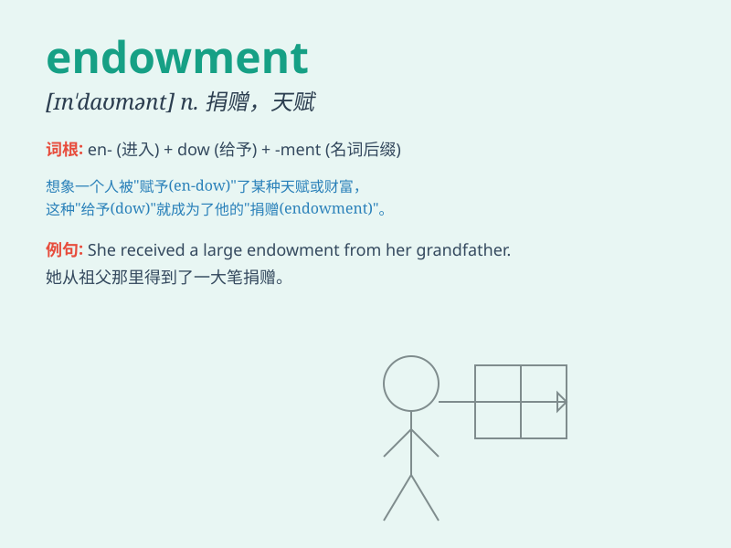

## endowment

**英音:** _[ɪn\'daʊm(ə)nt; en-]_ **美音:**
_[ɪn\'daʊmənt]_

**译义:** *n.捐赠,捐赠的基金(或财产),天资,捐款*

### 短语

+ **endowment insurance:** _养老保险_

+ **natural endowment:** _天赋；天然条件_

+ **endowment policy:** _养老保险单；储蓄保险单_

+ **endowment fund:** _捐赠基金；留本基金_

+ **intellectual endowment:** _智力天赋_

### 例句

#### 例句1

> **The university received a large endowment from a wealthy
alumnus.**

**中文翻译:** 这所大学从一位富有的校友那里收到了一大笔捐赠。

**单词释义:** 捐赠；捐款

#### 例句2

> **She has an endowment of intelligence and charm.**

**中文翻译:** 她天生聪明且富有魅力。

**单词释义:** 天赋；天资

#### 例句3

> **The endowment policy will mature in ten years.**

**中文翻译:** 这份养老保险单将在十年后到期。

**单词释义:** 养老保险金

### 背诵小故事

> A poor student was given an endowment by a kind old man. With this
financial support, the student could focus on studies and pursue his
dreams. The endowment changed his life.

**一个贫困的学生得到了一位善良老人的捐赠。有了这笔资金支持，这个学生能够专心学习并追求自己的梦想。这笔捐赠改变了他的人生。**

### 图义

