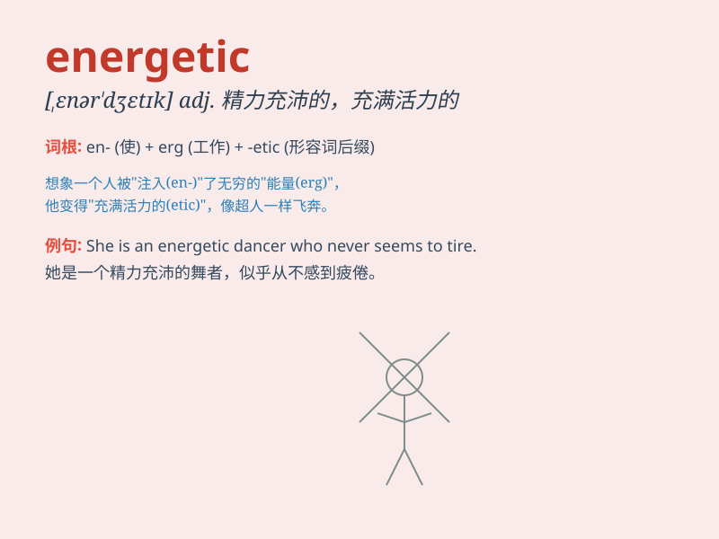

## energetic

**英音:** _[,enə\'dʒetɪk]_ **美音:** _[,ɛnɚ\'dʒɛtɪk]_

**译义:** *adj.精力充沛的,积极的*

### 短语

+ **energetic person:** _精力充沛的人_

+ **energetic performance:** _充满活力的表演_

+ **energetic exercise:** _剧烈的运动_

+ **energetic effort:** _积极的努力_

+ **energetic campaign:** _有力的活动_

### 例句

#### 例句1

> **She is an energetic girl who loves sports.**

**中文翻译:** 她是一个热爱运动、精力充沛的女孩。

**单词释义:** 精力充沛的

#### 例句2

> **The energetic performance of the band got the crowd excited.**

**中文翻译:** 乐队充满活力的表演让观众兴奋起来。

**单词释义:** 充满活力的

#### 例句3

> **He always has an energetic start to his day.**

**中文翻译:** 他每天总是精力充沛地开始。

**单词释义:** 精力旺盛的

### 背诵小故事

> One day, I went hiking. My friend Tom was so energetic. He climbed up
the mountain quickly and didn\'t feel tired at all. His energy made me
want to keep up with him.

**有一天，我去远足。我的朋友汤姆精力非常充沛。他很快就爬上了山，一点也不觉得累。他的活力让我想要跟上他。**

### 图义

