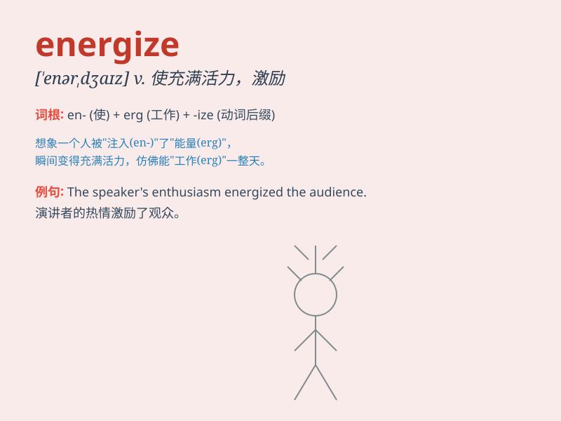

## energize

**英音:** _[\'enədʒaɪz]_ **美音:** _[\'ɛnɚdʒaɪz]_

**译义:** *vt.使活跃,给予精力,加强,给与\...电压vi.用力,活动*

### 短语

+ **energize sb/sth:** _给某人/某物提供能量；使某人/某物充满活力_

+ **energize the economy:** _给经济注入活力_

+ **energize oneself:** _使自己精力充沛_

+ **energize a project:** _为一个项目注入能量_

+ **energize the team:** _使团队充满活力_

### 例句

#### 例句1

> **The new policy is expected to energize the economy.**

**中文翻译:** 新政策有望为经济注入活力。

**单词释义:** 使充满活力；使精力充沛

#### 例句2

> **Exercise can energize you and improve your mood.**

**中文翻译:** 锻炼可以让你精力充沛并改善你的心情。

**单词释义:** 使有能量；使活跃

#### 例句3

> **The coach\'s speech energized the team before the game.**

**中文翻译:** 教练在比赛前的讲话让团队充满了活力。

**单词释义:** 激励；激发

### 背诵小故事

> A tired athlete was about to give up the race. But a magical drink
energized him. He felt full of power and finally crossed the finish
line. Now you know, energize means to give energy!

**一位疲惫的运动员即将放弃比赛。但一杯神奇的饮料为他补充了能量。他感到充满力量，最终冲过了终点线。现在你知道了，energize
意思是使充满活力，给予能量！**

### 图义

