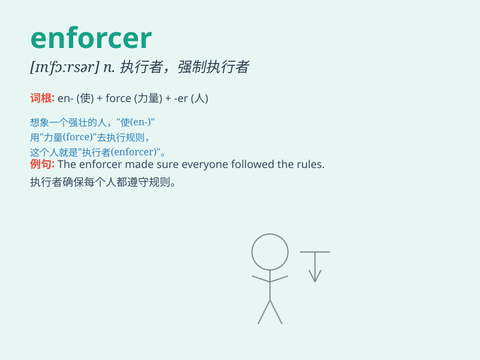

## enforcer

**英音:** _[ɪnˈfɔːsə(r)]_ **美音:** _[ɪnˈfɔːrsər]_

**译义:** *n. 实施者；强制执行者*

### 短语

+ **law enforcer:** _执法者_

+ **enforcer of rules:** _规则执行者_

+ **enforcer of discipline:** _纪律执行者_

+ **enforcer of contracts:** _合同执行者_

+ **enforcer of peace:** _和平维护者_

### 例句

#### 例句1

> **The enforcer of the law was feared by the criminals.**

**中文翻译:** 执法者令罪犯感到害怕。

**单词释义:** 执法者

#### 例句2

> **He acts as an enforcer for the company\'s strict policies.**

**中文翻译:** 他充当公司严格政策的执行者。

**单词释义:** 执行者

#### 例句3

> **The team needed a strong enforcer to maintain discipline.**

**中文翻译:** 这个团队需要一个强有力的纪律维护者。

**单词释义:** 维护者

### 背诵小故事

> A powerful superhero named Enforcer always appears when justice is
needed. He strictly enforces the law and punishes the villains. With his
super strength, no one dares to break the rules in his presence.

**一位强大的超级英雄名叫执法者，每当正义需要时他总会出现。他严格执行法律并惩罚坏人。凭借他的超强力量，在他面前无人敢违反规则。**

### 图义

