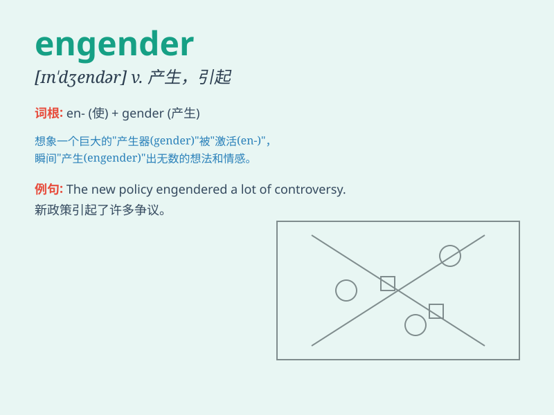

## engender

**英音:** _[ɪn\'dʒendə; en-]_ **美音:** _[ɪn\'dʒɛndɚ]_

**译义:** *v.造成*

### 短语

+ **engender conflict:** _引发冲突_

+ **engender trust:** _产生信任_

+ **engender hope:** _孕育希望_

+ **engender interest:** _引起兴趣_

+ **engender feelings:** _产生感情_

### 例句

#### 例句1

> **The new policy is likely to engender a lot of controversy.**

**中文翻译:** 这项新政策很可能会引发很多争议。

**单词释义:** 引发；产生

#### 例句2

> **His words engendered a sense of hope among the listeners.**

**中文翻译:** 他的话在听众中产生了一种希望感。

**单词释义:** 引起；造成

#### 例句3

> **The economic crisis engendered widespread unemployment.**

**中文翻译:** 经济危机导致了普遍的失业。

**单词释义:** 导致；致使

### 背诵小故事

> A magical tree has the power to engender new life. Every time its
leaves fall, little creatures are born. This shows how \'engender\'
means to cause or produce something.

**一棵神奇的树有产生新生命的能力。每次它的叶子掉落，就会有小生物诞生。这展示了\'engender\'意思是引起或产生某物。**

### 图义

