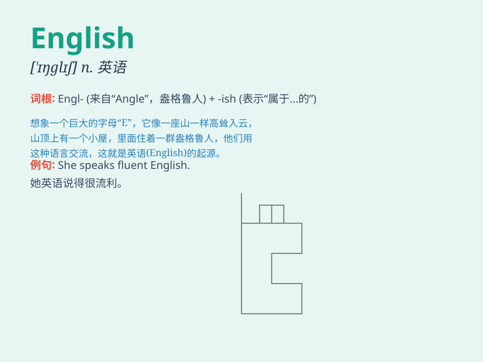

## English

**英音:** _[ˈɪŋɡlɪʃ]_ **美音:** _[ˈɪŋɡlɪʃ]_

**译义:** *n.英语；英文；英国人adj.英语的；英国的；英国人的*

### 短语

+ **English language:** _英语语言_

+ **English teacher:** _英语老师_

+ **English literature:** _英国文学_

+ **English breakfast:** _英式早餐_

+ **English corner:** _英语角_

### 例句

#### 例句1

> **I\'m learning English at school.**

**中文翻译:** 我正在学校学习英语。

**单词释义:** 英语（语言）

#### 例句2

> **She speaks fluent English.**

**中文翻译:** 她讲一口流利的英语。

**单词释义:** 英语（语言）

#### 例句3

> **The book is written in English.**

**中文翻译:** 这本书是用英语写的。

**单词释义:** 英语（语言）

### 背诵小故事

> A little boy named Tom was very interested in languages. One day, he
met a friendly fairy who taught him a special language called English.
Tom was so excited and practiced hard every day to master it.

**一个叫汤姆的小男孩对语言非常感兴趣。有一天，他遇到了一个友好的仙女，仙女教给他一种特别的语言叫英语。汤姆非常兴奋，每天都努力练习去掌握它。**

### 图义

