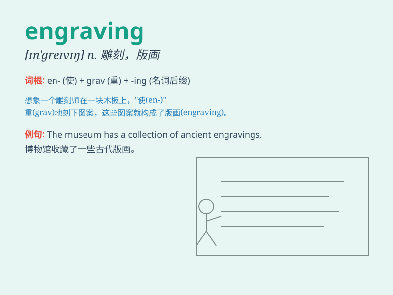

## engraving

**英音:** _[ɪn\'greɪvɪŋ; en-]_ **美音:** _[ɪn\'ɡrevɪŋ]_

**译义:** *n.雕刻术,雕版,雕版图*

### 短语

+ **engraving tool:** _雕刻工具_

+ **metal engraving:** _金属雕刻_

+ **engraving machine:** _雕刻机_

+ **wood engraving:** _木刻_

+ **engraving art:** _雕刻艺术_

### 例句

#### 例句1

> **The engraving on the ring was exquisite.**

**中文翻译:** 戒指上的雕刻很精美。

**单词释义:** 雕刻；镌刻

#### 例句2

> **He is skilled in engraving wood.**

**中文翻译:** 他擅长在木头上雕刻。

**单词释义:** 雕刻（的技艺）

#### 例句3

> **The museum displayed an ancient engraving of a battle scene.**

**中文翻译:** 博物馆展示了一幅古代的战斗场景的雕刻。

**单词释义:** 雕刻作品

### 背诵小故事

> Once upon a time, a skilled artist was doing engraving on a precious
metal plate. He carefully chiseled beautiful patterns, making the plate
a unique work of art. The process of this engraving was truly amazing.

**从前，有一位技艺精湛的艺术家正在一块珍贵的金属板上进行雕刻。他小心翼翼地凿出美丽的图案，使这块板子成为一件独特的艺术品。这个雕刻的过程真是令人惊叹。**

### 图义

