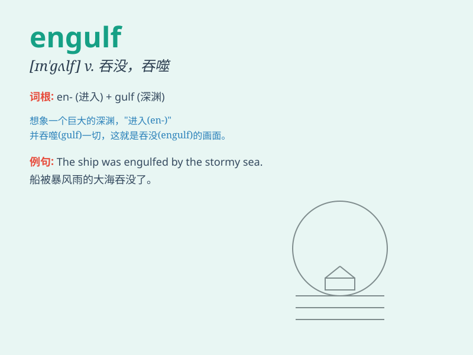

## engulf

**英音:** _[ɪn\'gʌlf; en-]_ **美音:** _[ɛnˈɡʌlf]_

**译义:** *vt.卷入,吞没,狼吞虎咽*

### 短语

+ **be engulfed in:** _被\...吞没；沉浸于_

+ **engulf oneself in:** _使自己沉浸于_

+ **engulf the city:** _吞没城市_

+ **engulf the village:** _吞没村庄_

+ **engulf the coast:** _吞没海岸_

### 例句

#### 例句1

> **The waves engulfed the small boat.**

**中文翻译:** 海浪吞没了那艘小船。

**单词释义:** 吞没；淹没

#### 例句2

> **The fire quickly engulfed the entire building.**

**中文翻译:** 大火迅速吞没了整栋大楼。

**单词释义:** 吞没；席卷

#### 例句3

> **Darkness engulfed the forest as night fell.**

**中文翻译:** 夜幕降临，黑暗吞没了森林。

**单词释义:** 吞没；笼罩

### 背诵小故事

>
想象你在海边玩耍，突然一个巨大的海浪冲过来，瞬间就把你和周围的一切都'engulf'了，就像一张大口把所有东西都吞进去一样。

**想象你在海边，一个大浪瞬间吞没了你和周围的一切，就像'engulf'这个单词表示吞没、淹没的意思。**

### 图义

