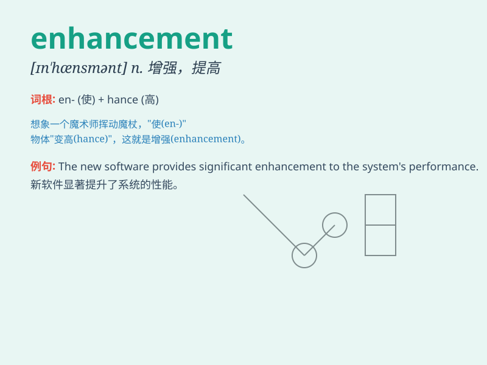

## enhancement

**英音:** _[ɪn\'hɑːnsm(ə)nt; en-]_ **美音:**
_[in\'hænsmənt]_

**译义:** *n.增进,增加*

### 短语

+ **performance enhancement:** _性能提升_

+ **image enhancement:** _图像增强_

+ **quality enhancement:** _质量提高_

+ **feature enhancement:** _功能增强_

+ **signal enhancement:** _信号增强_

### 例句

#### 例句1

> **The new software provides an enhancement to the user
experience.**

**中文翻译:** 新软件为用户体验提供了增强。

**单词释义:** 增强；提高

#### 例句2

> **The enhancement of her skills through training was
remarkable.**

**中文翻译:** 通过培训，她技能的提高非常显著。

**单词释义:** 提高；增强

#### 例句3

> **This enhancement in security measures will prevent unauthorized
access.**

**中文翻译:** 这种安全措施的增强将防止未经授权的访问。

**单词释义:** 增强；加强

### 背诵小故事

> A scientist was working hard on a project. One day, he made a great
discovery that brought an enhancement to the technology. It was like
adding a shiny new part to a machine, making it work better and more
efficiently.

**一位科学家正在努力做一个项目。有一天，他有了一个重大发现，给技术带来了提升。这就像给机器添加了一个闪亮的新部件，使其工作得更好、更高效。**

### 图义

