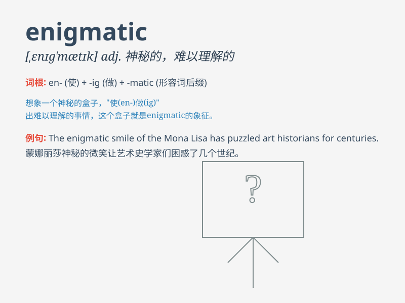

## enigmatic

**英音:** _[,enɪg\'mætɪk]_ **美音:** _[\'ɛnɪg\'mætɪk]_

**译义:** *adj.谜一般的,高深莫测的*

### 短语

+ **enigmatic smile:** _神秘的微笑_

+ **enigmatic figure:** _神秘的人物_

+ **enigmatic message:** _神秘的信息_

+ **enigmatic behavior:** _神秘的行为_

+ **enigmatic expression:** _神秘的表情_

### 例句

#### 例句1

> **The Mona Lisa has an enigmatic smile that has puzzled viewers for
centuries.**

**中文翻译:**
《蒙娜丽莎》有着神秘的微笑，几个世纪以来一直困扰着观众。

**单词释义:** 神秘的

#### 例句2

> **His behavior during the meeting was enigmatic; no one could
understand his motives.**

**中文翻译:** 他在会议期间的行为令人费解；没人能理解他的动机。

**单词释义:** 难以理解的；神秘莫测的

#### 例句3

> **The old house on the hill had an enigmatic presence, as if it
held many secrets.**

**中文翻译:**
山上的那座老房子有一种神秘的存在，仿佛它隐藏着许多秘密。

**单词释义:** 神秘的；谜一般的

### 背诵小故事

> A detective was trying to solve a mysterious case. The clues were
enigmatic. Every step forward led to more confusion. But finally, with
sharp thinking, the detective cracked the enigmatic puzzle.

**一位侦探试图解决一起神秘的案件。线索令人费解。每前进一步都会带来更多的困惑。但最终，凭借敏锐的思维，侦探破解了这个神秘莫测的谜团。**

### 图义

