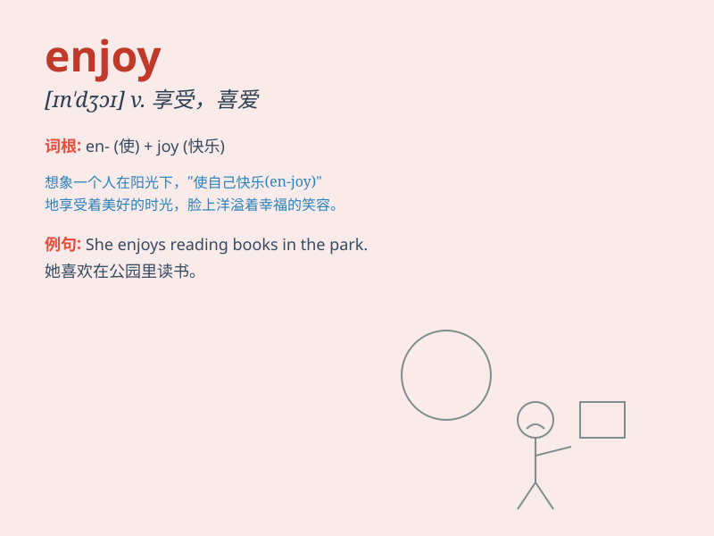

## enjoy

**英音:** _[ɪnˈdʒɔɪ]_ **美音:** _[ɪn\'dʒɔɪ]_

**译义:** *vt.享受\...的乐趣,欣赏,喜爱v.满意*

### 短语

+ **enjoy oneself:** _过得快活，感到愉快_

+ **enjoy doing sth:** _喜欢做某事_

+ **enjoy life:** _享受生活_

+ **enjoy great popularity:** _大受欢迎_

+ **enjoy good health:** _身体健康_

### 例句

#### 例句1

> **I enjoy reading books in my spare time.**

**中文翻译:** 我在业余时间喜欢读书。

**单词释义:** 喜欢，享受

#### 例句2

> **They enjoy the party very much.**

**中文翻译:** 他们非常享受这个聚会。

**单词释义:** 享受

#### 例句3

> **She enjoys traveling around the world.**

**中文翻译:** 她喜欢环游世界。

**单词释义:** 喜欢

### 背诵小故事

> One day, I went to an amusement park. I rode the thrilling roller
coaster and ate delicious cotton candy. I truly enjoyed every moment. It
was a wonderful day!

**有一天，我去了一个游乐园。我坐了刺激的过山车，吃了美味的棉花糖。我真的享受每一刻。这是美好的一天！**

### 图义

