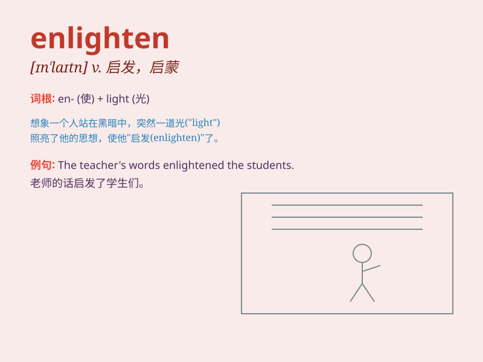

## enlighten

**英音:** _[ɪn\'laɪt(ə)n; en-]_ **美音:** _[ɪn\'laɪtn]_

**译义:** *vt.启发,启蒙,教导,授予\...知识,开导,\<古>照耀*

### 短语

+ **enlighten sb on sth:** _在某事上给某人以启迪_

+ **enlighten one\'s mind:** _启发某人的思维_

+ **be enlightened:** _受到启发；变得开明_

+ **enlighten about:** _关于\...\...进行启蒙_

+ **enlighten upon:** _对\...\...予以阐明_

### 例句

#### 例句1

> **The teacher enlightened the students on the complex topic.**

**中文翻译:** 老师在这个复杂的主题上启发了学生。

**单词释义:** 启发；开导

#### 例句2

> **This book enlightened me about the history of art.**

**中文翻译:** 这本书让我对艺术史有了新的认识。

**单词释义:** 使明白；使领悟

#### 例句3

> **His words enlightened her and she changed her mind.**

**中文翻译:** 他的话启发了她，她改变了主意。

**单词释义:** 启迪；教导

### 背诵小故事

> One day, a wise old owl enlightened a lost little bird. The owl
shared its wisdom and knowledge, making the little bird see the world
clearly. Just like that, the little bird was enlightened and found its
way home.

**一天，一只聪明的老猫头鹰启发了一只迷路的小鸟。猫头鹰分享了它的智慧和知识，让小鸟清晰地看到了世界。就像这样，小鸟受到了启发，找到了回家的路。**

### 图义

