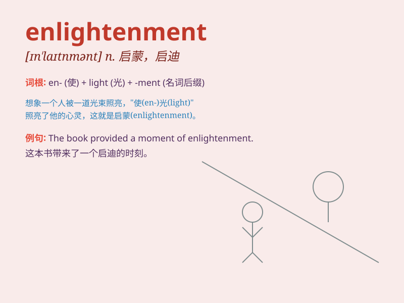

## enlightenment

**英音:** _[ɪn\'laɪt(ə)nm(ə)nt; en-]_ **美音:**
_[ɪn\'laɪtnmənt]_

**译义:** *n.启迪,教化*

### 短语

+ **spiritual enlightenment:** _精神上的觉悟_

+ **enlightenment thought:** _启蒙思想_

+ **age of enlightenment:** _启蒙时代_

+ **seek enlightenment:** _寻求开悟_

+ **attain enlightenment:** _获得觉悟_

### 例句

#### 例句1

> **The book provided me with great enlightenment on philosophy.**

**中文翻译:** 这本书在哲学方面给了我很大的启发。

**单词释义:** 启发；启迪

#### 例句2

> **His speech was a source of enlightenment for the audience.**

**中文翻译:** 他的演讲对听众来说是一种启迪之源。

**单词释义:** 启迪；开导

#### 例句3

> **The journey brought about a spiritual enlightenment for her.**

**中文翻译:** 这次旅行给她带来了精神上的觉悟。

**单词释义:** 觉悟；启蒙

### 背诵小故事

> A young man was lost in the dark forest. One day, he suddenly saw a
bright light. It guided him out and gave him enlightenment. He
understood the true meaning of life and found his direction.

**一个年轻人在黑暗的森林中迷失了。有一天，他突然看到一道亮光。这道光引导他走出森林并给了他启示。他明白了生命的真谛并找到了方向。**

### 图义

