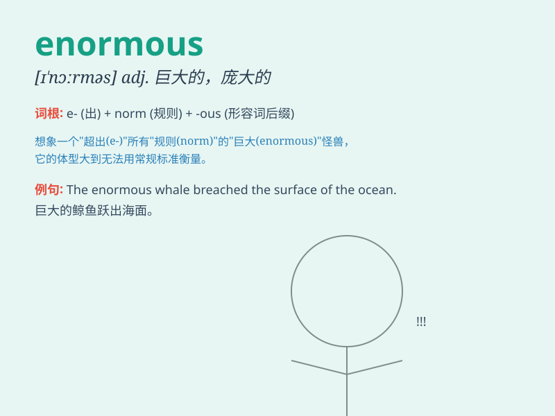

## enormous

**英音:** _[ɪ\'nɔːməs]_ **美音:** _[ɪ\'nɔrməs]_

**译义:** *adj.巨大的,庞大的,\<古>极恶的,凶暴的*

### 短语

+ **enormous amount:** _巨大的数量_

+ **enormous potential:** _巨大的潜力_

+ **enormous impact:** _巨大的影响_

+ **enormous success:** _巨大的成功_

+ **enormous responsibility:** _巨大的责任_

### 例句

#### 例句1

> **The company has made an enormous profit this year.**

**中文翻译:** 这家公司今年获得了巨大的利润。

**单词释义:** 巨大的

#### 例句2

> **She has an enormous amount of work to do.**

**中文翻译:** 她有大量的工作要做。

**单词释义:** 大量的

#### 例句3

> **The elephant has an enormous body.**

**中文翻译:** 大象有庞大的身躯。

**单词释义:** 庞大的

### 背诵小故事

> A tiny ant was always dreaming of finding an enormous cake. One day,
it found a cake as big as a mountain. The ant was amazed by the enormous
size. It realized that \'enormous\' means extremely large.

**一只小蚂蚁总是梦想着能找到一个巨大的蛋糕。有一天，它真的发现了一个像山一样大的蛋糕。蚂蚁被这巨大的尺寸震惊了。它明白了'enormous'就是指极其大的。**

### 图义

