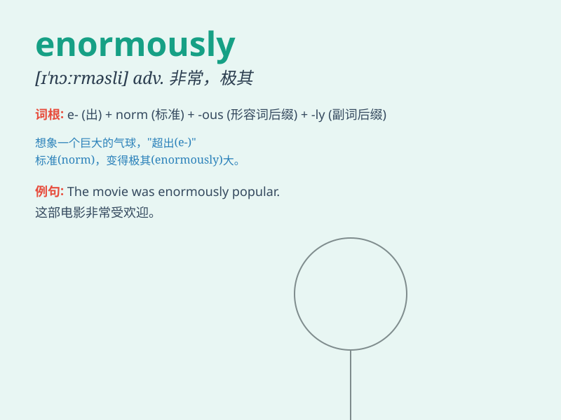

## enormously

**英音:** _[ɪ\'nɔːməslɪ]_ **美音:** _[ɪ\'nɔrməsli]_

**译义:** *adv.非常地,巨大地*

### 短语

+ **enormously successful:** _极其成功_

+ **enormously grateful:** _非常感激_

+ **enormously influential:** _非常有影响力_

+ **enormously expensive:** _极其昂贵_

+ **enormously popular:** _非常受欢迎_

### 例句

#### 例句1

> **The company has grown enormously in the past few years.**

**中文翻译:** 这家公司在过去几年里发展得极为迅速。

**单词释义:** 非常；极其；极大地

#### 例句2

> **Her contribution to the project was enormously valuable.**

**中文翻译:** 她对这个项目的贡献极有价值。

**单词释义:** 极大地；非常

#### 例句3

> **The new law will enormously affect our daily lives.**

**中文翻译:** 新法律将极大地影响我们的日常生活。

**单词释义:** 极大地；巨大地

### 背诵小故事

> A little ant wanted to cross a huge river. It seemed impossible, but
with enormously strong willpower, it found a way. Finally, it reached
the other side. \'Enormously\' means very greatly or to a large extent.

**一只小蚂蚁想要穿过一条大河。这看似不可能，但凭借着极其强大的意志力，它找到了办法。最终，它到达了对岸。\'Enormously\'意思是非常、极大程度上。**

### 图义

