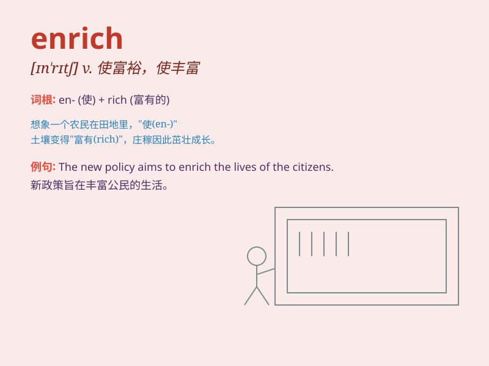

## enrich

**英音:** _[ɪn\'rɪtʃ; en-]_ **美音:** _[ɪn\'rɪtʃ]_

**译义:** *vt.使富足,使肥沃,装饰,加料于,浓缩*

### 短语

+ **enrich oneself:** _发财，致富_

+ **enrich life:** _丰富生活_

+ **enrich knowledge:** _丰富知识_

+ **enrich experience:** _丰富经验_

+ **enrich soil:** _使土壤肥沃_

### 例句

#### 例句1

> **The reading of various kinds of good books can enrich our
minds.**

**中文翻译:** 阅读各种好书能够丰富我们的思想。

**单词释义:** 使丰富；充实

#### 例句2

> **The soil was enriched with fertilizer.**

**中文翻译:** 土壤因施肥而肥沃。

**单词释义:** 使肥沃；使富足

#### 例句3

> **Traveling greatly enriches one\'s experience.**

**中文翻译:** 旅行大大丰富了人的阅历。

**单词释义:** 丰富；充实

### 背诵小故事

> Once upon a time, a poor farmer found a magic stone. Every time he
touched his crops with it, they grew better and became more fruitful.
This stone was like a power to \'enrich\' his life and make him happy.

**从前，有个贫穷的农民发现了一块魔法石。每次他用它触碰庄稼，庄稼就长得更好，果实更丰硕。这块石头就像是一种能'使丰富、充实'他生活并让他开心的力量。**

### 图义

