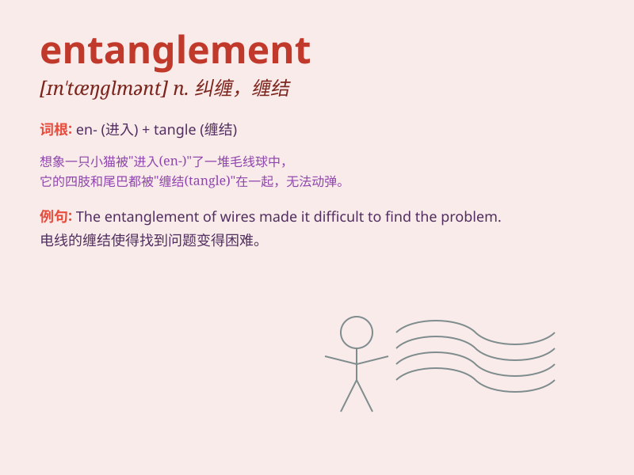

## entanglement

**英音:** _[ɪn\'tæŋg(ə)lm(ə)nt; en-]_ **美音:**
_[ɪn\'tæŋɡlmənt]_

**译义:** *n.纠缠*

### 短语

+ **quantum entanglement:** _量子纠缠_

+ **emotional entanglement:** _情感纠葛_

+ **legal entanglement:** _法律纠纷_

+ **complex entanglement:** _复杂的纠缠_

+ **web of entanglement:** _纠缠之网_

### 例句

#### 例句1

> **The bird got caught in an entanglement of branches.**

**中文翻译:** 这只鸟被困在了树枝的缠绕之中。

**单词释义:** 缠绕；纠结

#### 例句2

> **Their relationship was full of emotional entanglements.**

**中文翻译:** 他们的关系充满了情感纠葛。

**单词释义:** 纠葛；牵连

#### 例句3

> **The legal entanglement took months to resolve.**

**中文翻译:** 这起法律纠纷花了数月才解决。

**单词释义:** 纠纷；复杂的关系

### 背诵小故事

> A brave explorer was in the jungle. Suddenly, he got into an
entanglement of vines. Struggling hard, he finally broke free. The
entanglement was like a trap but he overcame it.

**一位勇敢的探险家在丛林中。突然，他陷入了藤蔓的纠缠之中。经过努力挣扎，他最终挣脱了。这种纠缠就像一个陷阱，但他克服了。**

### 图义

