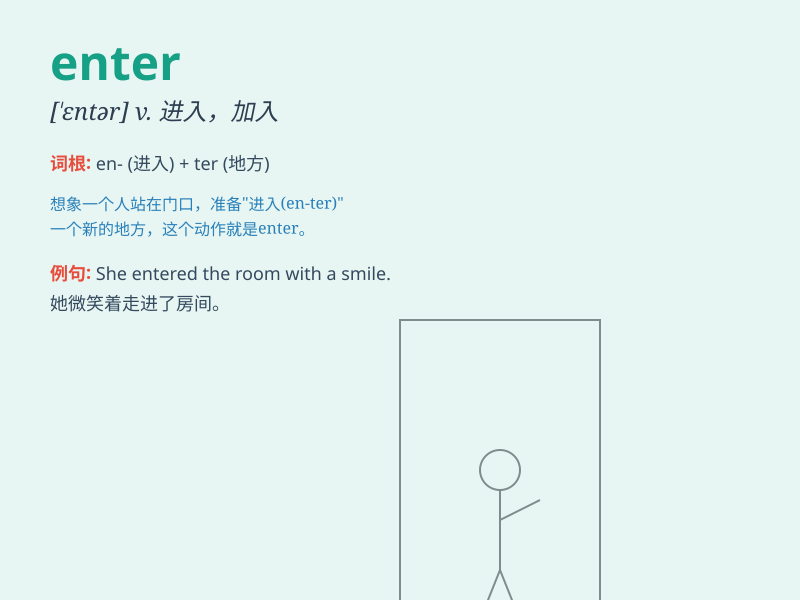

## enter

**英音:** _[\'entə]_ **美音:** _[\'ɛntɚ]_

**译义:**
*vt.进入,加入,参加,登录,开始vi.进去,[戏]登场,参加n.输入,[计]回车*

### 短语

+ **enter into:** _开始；参与；达成（协议等）_

+ **enter for:** _报名参加（竞赛、考试等）_

+ **enter upon:** _开始；着手_

+ **enter into force:** _生效；开始实行_

+ **enter one\'s name:** _登记名字_

### 例句

#### 例句1

> **Please enter the room quietly.**

**中文翻译:** 请安静地进入房间。

**单词释义:** 进入

#### 例句2

> **You need to enter your password to log in.**

**中文翻译:** 你需要输入你的密码来登录。

**单词释义:** 输入

#### 例句3

> **The data will enter the system automatically.**

**中文翻译:** 数据将自动进入系统。

**单词释义:** 进入

### 背诵小故事

> A little mouse wanted to enter a big house to find food. It found a
small hole and bravely went in. Finally, it entered the house
successfully.

**一只小老鼠想要进入一个大房子找食物。它发现了一个小洞，勇敢地走了进去。最后，它成功地进入了房子。**

### 图义

