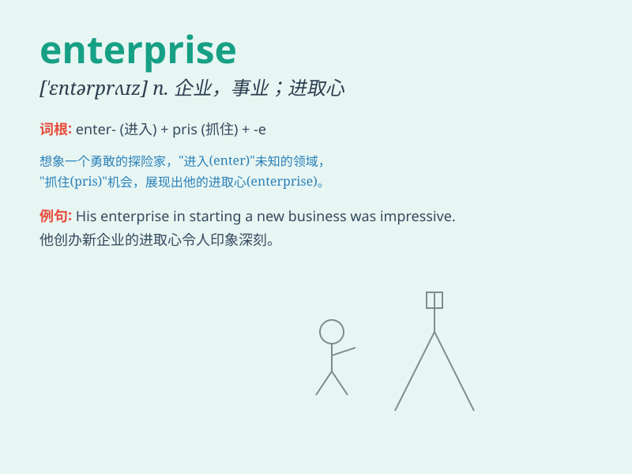

## enterprise

**英音:** _[\'entəpraɪz]_ **美音:** _[\'ɛntɚ\'praɪz]_

**译义:** *n.企业,事业,计划,事业心,进取心,干事业*

### 短语

+ **enterprise zone:** _企业振兴区_

+ **private enterprise:** _私人企业_

+ **enterprise culture:** _企业文化_

+ **enterprising spirit:** _进取精神；创业精神_

+ **state-owned enterprise:** _国有企业_

### 例句

#### 例句1

> **The enterprise has achieved remarkable success in the
international market.**

**中文翻译:** 企业在国际市场上取得了令人瞩目的成功。

**单词释义:** 企业

#### 例句2

> **She has a spirit of enterprise and is always looking for new
opportunities.**

**中文翻译:** 她具有进取精神，总是在寻找新的机会。

**单词释义:** 进取心；事业心

#### 例句3

> **The government is encouraging small enterprises to develop.**

**中文翻译:** 政府鼓励小企业发展。

**单词释义:** 企业；公司

### 背诵小故事

> A brave young man decided to start an enterprise. He faced many
difficulties but never gave up. With hard work and smart decisions, his
enterprise became very successful. Now you know, enterprise means a
business or project!

**一位勇敢的年轻人决定创办一家企业。他面临许多困难，但从未放弃。通过努力工作和明智的决策，他的企业变得非常成功。现在你知道了，enterprise
意思是企业、事业。**

### 图义

