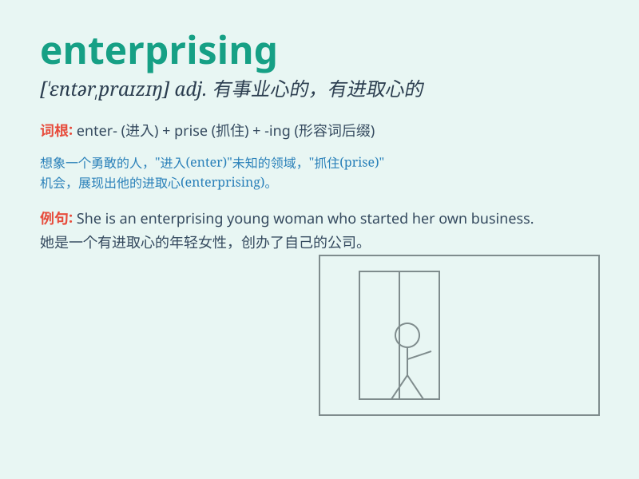

## enterprising

**英音:** _[\'entəpraɪzɪŋ]_ **美音:** _[\'ɛntɚpraɪzɪŋ]_

**译义:** *adj.有事业心的,有进取心的,有魄力的,有胆量的,富有进取心*

### 短语

+ **enterprising spirit:** _进取精神；创业精神_

+ **enterprising individual:** _有进取心的个人_

+ **enterprising attitude:** _进取的态度_

+ **enterprising entrepreneur:** _有事业心的企业家_

+ **enterprising initiative:** _进取的举措_

### 例句

#### 例句1

> **He is an enterprising young man who started his own business at
the age of 20.**

**中文翻译:** 他是一位有进取心的年轻人，20岁就开始自己创业。

**单词释义:** 有进取心的；有事业心的

#### 例句2

> **The enterprising company is always looking for new opportunities
to expand.**

**中文翻译:** 这家进取的公司总是在寻找新的扩张机会。

**单词释义:** 有进取精神的

#### 例句3

> **She has an enterprising spirit and is not afraid of
challenges.**

**中文翻译:** 她有进取精神，不惧怕挑战。

**单词释义:** 进取的

### 背诵小故事

> A young man named Tom was very enterprising. He saw an opportunity to
start a new business in his town. Despite many difficulties, he was
brave and worked hard. Finally, his business succeeded.

**一个叫汤姆的年轻人非常有进取心。他看到在他的镇上开展新业务的机会。尽管面临许多困难，他勇敢且努力工作。最终，他的生意成功了。**

### 图义

