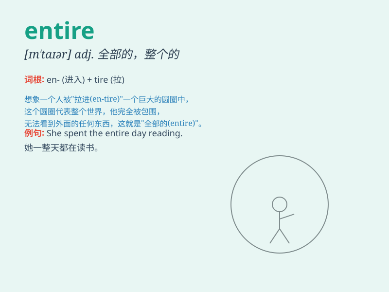

## entire

**英音:** _[ɪn\'taɪə; en-]_ **美音:** _[ɪn\'taɪɚ]_

**译义:** *adj.全部的,完整的,整个*

### 短语

+ **entire life:** _一生；整个生命_

+ **entire world:** _整个世界_

+ **entire family:** _全家；整个家庭_

+ **entire process:** _整个过程_

+ **entire amount:** _全部金额；总额_

### 例句

#### 例句1

> **The entire family went on vacation.**

**中文翻译:** 整个家庭都去度假了。

**单词释义:** 整个的

#### 例句2

> **He spent his entire life in this town.**

**中文翻译:** 他在这个镇上度过了一生。

**单词释义:** 全部的

#### 例句3

> **The entire project was a success.**

**中文翻译:** 整个项目是成功的。

**单词释义:** 整个的

### 背诵小故事

> A king wanted to give a reward to the entire kingdom. He announced
that everyone would get a special gift. The word \'entire\' here means
all, without any part left out.

**一位国王想要给整个王国赏赐。他宣布每个人都会得到一份特别的礼物。这里的'entire'这个单词意思是全部的，没有任何部分被遗漏。**

### 图义

