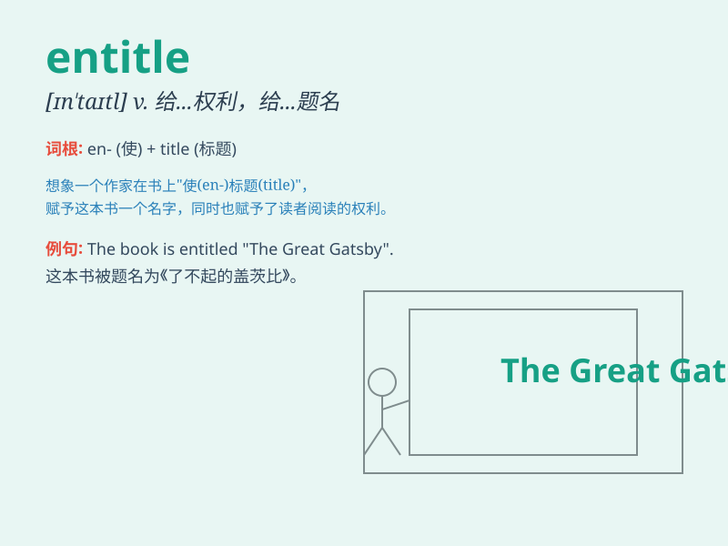

## entitle

**英音:** _[ɪn\'taɪt(ə)l; en-]_ **美音:** _[ɪn\'taɪtl]_

**译义:** *vt.给\...权利(或资格),给\...题名,给\...称号v.授权,授权*

### 短语

+ **entitle sb to sth:** _使某人有权得到某物_

+ **be entitled to:** _有权；有资格_

+ **entitle sth to sb:** _给某人某物的权利_

+ **entitle oneself to:** _自称有（某种权利或资格）_

+ **entitle a book:** _给书定名_

### 例句

#### 例句1

> **This ticket entitles you to a free meal.**

**中文翻译:** 这张票使你有权享用一顿免费餐。

**单词释义:** 使有权；给予\...\...权利

#### 例句2

> **The book is entitled \'My Adventures\'.**

**中文翻译:** 这本书的书名为《我的冒险》。

**单词释义:** 给\...\...命名；定名为

#### 例句3

> **You are not entitled to unemployment benefit if you have never
worked.**

**中文翻译:** 如果你从未工作过，你就没有资格领取失业救济金。

**单词释义:** 使有资格；给予\...\...资格

### 背诵小故事

> A king was very generous and he wanted to entitle every hardworking
citizen to a piece of land. So, he gave them the right to own it.
Entitle means to give the right to.

**一位国王非常慷慨，他想要赋予每个勤劳的公民一块土地。所以，他给予他们拥有的权利。entitle
意思是给予权利。**

### 图义

