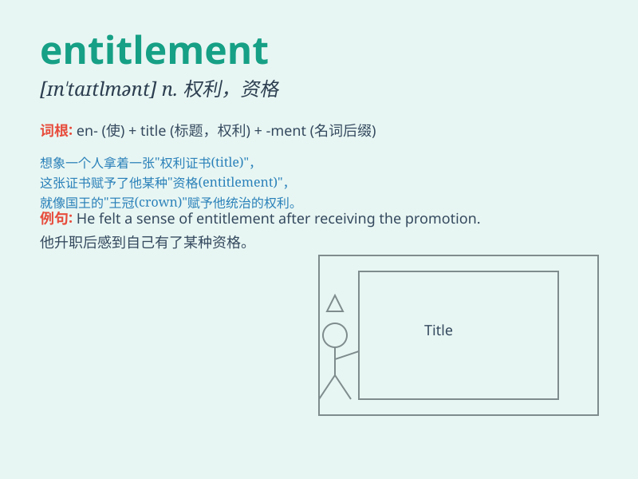

## entitlement

**英音:** _[ɪnˈtaɪtlmənt]_ **美音:** _[ɪnˈtaɪtlmənt]_

**译义:** *n. 权利；资格；应得权益*

### 短语

+ **entitlement program:** _福利计划_

+ **sense of entitlement:** _权利意识；特权感_

+ **entitlement spending:** _福利支出_

+ **job entitlement:** _工作应享权利_

+ **entitlement mentality:** _权利心态_

### 例句

#### 例句1

> **She has a strong sense of entitlement and always expects special
treatment.**

**中文翻译:** 她有一种强烈的权利感，总是期待特殊待遇。

**单词释义:** 权利感；应得的权利

#### 例句2

> **The new law aims to limit entitlement programs and reduce
government spending.**

**中文翻译:** 新法律旨在限制福利项目并减少政府开支。

**单词释义:** 福利；津贴

#### 例句3

> **His sense of entitlement made it difficult for him to accept
criticism.**

**中文翻译:** 他的权利意识使他难以接受批评。

**单词释义:** 权利意识

### 背诵小故事

> A king felt a strong sense of entitlement. He believed everything in
the kingdom belonged to him. But his arrogance led to people\'s
dissatisfaction. Eventually, he learned that entitlement without
responsibility was wrong.

**一位国王有着强烈的权利感。他认为王国里的一切都属于他。但他的傲慢导致了人们的不满。最终，他明白了没有责任的权利是错误的。**

### 图义

