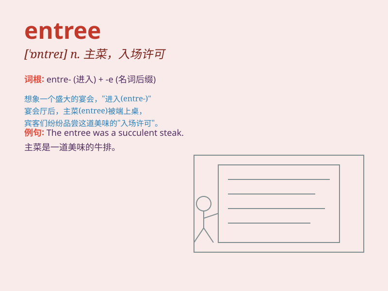

## entree

**英音:** _[ˈɔntreɪ]_ **美音:** _[\'ɑntre]_

**译义:** *n.入场许可,\<英>两道正菜间的小菜,\<美>主菜*

### 短语

+ **main entree:** _主菜_

+ **entree dish:** _正菜_

+ **delicious entree:** _美味的主菜_

+ **entree course:** _主菜部分_

+ **select an entree:** _选择一道主菜_

### 例句

#### 例句1

> **The entree at the fancy restaurant was a perfectly cooked
steak.**

**中文翻译:** 这家高档餐厅的主菜是一份烹饪得恰到好处的牛排。

**单词释义:** 主菜

#### 例句2

> **She chose the fish entree for her dinner.**

**中文翻译:** 她晚餐选择了鱼做主菜。

**单词释义:** 主菜

#### 例句3

> **The entree of the party was a grand spectacle.**

**中文翻译:** 聚会的入场式是一场盛大的奇观。

**单词释义:** 入场；进入

### 背诵小故事

> Once upon a time, a hungry traveler arrived at a restaurant. The
waiter recommended the \'entree\' dish, which was a delicious main
course. The traveler enjoyed it very much and remembered the word
\'entree\' for its special meaning.

**从前，有一个饥饿的旅行者来到一家餐馆。服务员推荐了'entree'这道菜，这是一道美味的主菜。旅行者非常喜欢，也记住了'entree'这个有特殊含义的单词。**

### 图义

