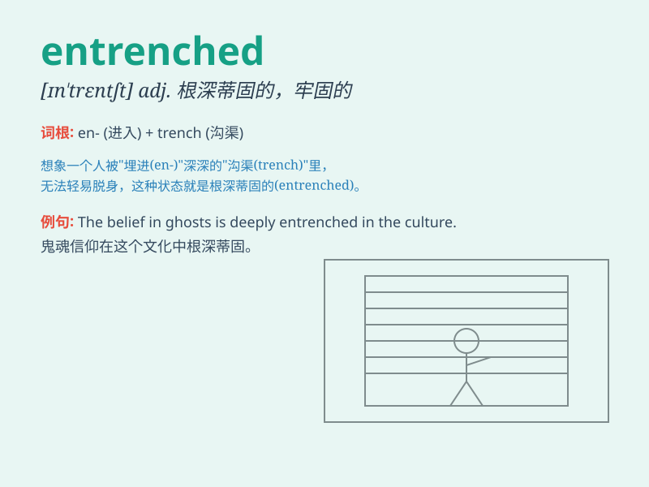

## entrenched

**英音:** _[in\'trentʃt]_ **美音:** _[in\'tren.tʃd]_

**译义:**
*adj.根深蒂固的，牢固确立的；被困住的，深陷的（该词常用于描述观念、习惯或者人处于一种很难改变的状态或位置）*

### 短语

+ **entrenched position:** _牢固的地位；根深蒂固的立场_

+ **entrenched habit:** _根深蒂固的习惯_

+ **entrenched belief:** _根深蒂固的信念_

+ **become entrenched:** _变得根深蒂固_

+ **deeply entrenched:** _深深扎根的；根深蒂固的_

### 例句

#### 例句1

> **The company\'s entrenched position in the market made it
difficult for new competitors to enter.**

**中文翻译:**
这家公司在市场上根深蒂固的地位使得新的竞争对手难以进入。

**单词释义:** 根深蒂固的

#### 例句2

> **He has an entrenched habit of smoking after meals.**

**中文翻译:** 他有饭后抽烟的顽固习惯。

**单词释义:** 顽固的；难以改变的

#### 例句3

> **The political party\'s entrenched power was challenged by the
opposition.**

**中文翻译:** 该政党的稳固权力受到了反对派的挑战。

**单词释义:** 稳固的；确立的

### 背诵小故事

> A soldier was entrenched in a deep foxhole during the war. He was
well-protected and hard to be reached by the enemies. \'Entrenched\'
here means firmly established and difficult to change.

**一名士兵在战争期间固守在一个深深的散兵坑里。他受到了很好的保护，敌人很难接近他。\'entrenched\'在这里意味着牢固确立且难以改变。**

### 图义

