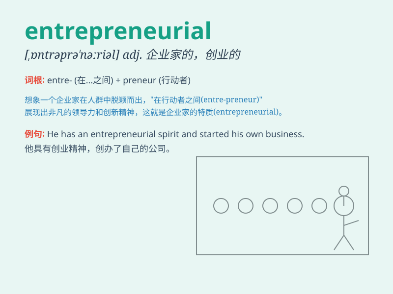

## entrepreneurial

**英音:** _[ˌɒn.trə.prəˈnɜːr.əl]_ **美音:**
_[ˌɛn.trə.prəˈnɜr.i.əl]_

**译义:** *企业家精神的；具有创业精神的*

### 短语

+ **entrepreneurial spirit:** _企业家精神_

+ **entrepreneurial mindset:** _创业心态_

+ **entrepreneurial activity:** _创业活动_

+ **entrepreneurial venture:** _创业风险_

+ **entrepreneurial skills:** _创业技能_

### 例句

#### 例句1

> **She has an entrepreneurial spirit and is always looking for new
business opportunities.**

**中文翻译:** 她具有企业家精神，总是在寻找新的商业机会。

**单词释义:** 具有创业精神的

#### 例句2

> **The city has a vibrant entrepreneurial ecosystem that supports
startups.**

**中文翻译:**
这座城市拥有一个充满活力的创业生态系统，为初创企业提供支持。

**单词释义:** 创业的

#### 例句3

> **His entrepreneurial skills helped him turn a small idea into a
successful company.**

**中文翻译:** 他的创业技能帮助他将一个小想法变成了一家成功的公司。

**单词释义:** 企业家的

### 背诵小故事

> A young man named Tom always had entrepreneurial ideas. One day, he
saw an opportunity in the market and decided to start his own business.
With his passion and determination, he became a successful entrepreneur.
Remember, entrepreneurial means having the spirit and skills to start
and run a business.

**一个叫汤姆的年轻人总是有创业的想法。有一天，他看到了市场中的一个机会，决定自己创业。凭借他的热情和决心，他成为了一名成功的企业家。记住，entrepreneurial
意思是具有创业的精神和技能。**

### 图义

