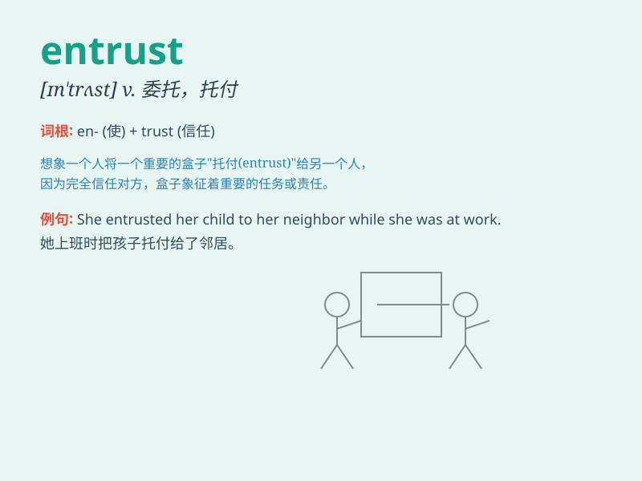

## entrust

**英音:** _[ɪn\'trʌst; en-]_ **美音:** _[ɪn\'trʌst]_

**译义:** *v.委托*

### 短语

+ **entrust with:** _托付；委托_

+ **entrust to:** _交托给；委托给_

+ **entrust someone with something:** _把某物托付给某人_

+ **entrust something to someone:** _把某事交托给某人_

+ **entrust responsibility:** _赋予责任_

### 例句

#### 例句1

> **I entrusted my keys to my neighbor when I went on vacation.**

**中文翻译:** 我去度假时把钥匙托付给了邻居。

**单词释义:** 托付

#### 例句2

> **The manager entrusted the important project to the experienced
team.**

**中文翻译:** 经理把重要的项目委托给了有经验的团队。

**单词释义:** 委托

#### 例句3

> **She entrusted her secret to her best friend.**

**中文翻译:** 她把自己的秘密托付给了她最好的朋友。

**单词释义:** 托付

### 背诵小故事

> A king was going on a long journey. He entrusted his precious
treasure to a trusted knight, believing that the knight would keep it
safe. \'Entrust\' means to give something valuable or important to
someone for them to take care of.

**一位国王要去长途旅行。他把珍贵的财宝托付给了一位信任的骑士，相信骑士会保管好它。"entrust"意思是把有价值或重要的东西交给某人让其照顾。**

### 图义

