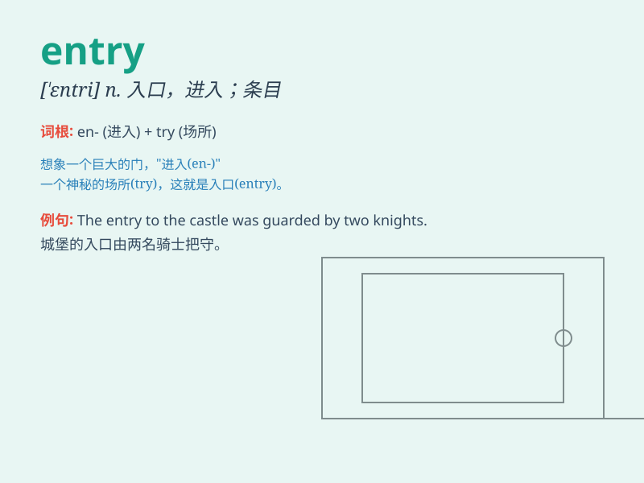

## entry

**英音:** _[ˈentrɪ]_ **美音:** _[\'ɛntri]_

**译义:**
*n.登录,条目,进入,入口,[商]报关手续,[律]对土地的侵占,对房屋的侵入*

### 短语

+ **entry point:** _入口点；切入点_

+ **data entry:** _数据输入；资料登录_

+ **entry fee:** _报名费；参赛费_

+ **entry level:** _入门级；初级水平_

+ **no entry:** _禁止进入_

### 例句

#### 例句1

> **The entry fee for the competition is \$20.**

**中文翻译:** 这次比赛的参赛费是 20 美元。

**单词释义:** 参赛费；进入的费用

#### 例句2

> **There was a long entry about the history of the building in the
encyclopedia.**

**中文翻译:** 在百科全书中有关于这座建筑历史的很长的条目。

**单词释义:** 条目；词条

#### 例句3

> **The thief made his entry through the back window.**

**中文翻译:** 小偷从后窗进入。

**单词释义:** 进入；入场

### 背诵小故事

> A brave explorer was looking for a hidden treasure. The only way to
find it was through a mysterious ENTRY. After much effort, he finally
found the right ENTRY and discovered the precious treasure inside.

**一位勇敢的探险家正在寻找一处隐藏的宝藏。找到它的唯一途径是通过一个神秘的入口。经过大量努力，他终于找到了正确的入口，并在里面发现了珍贵的宝藏。**

### 图义

