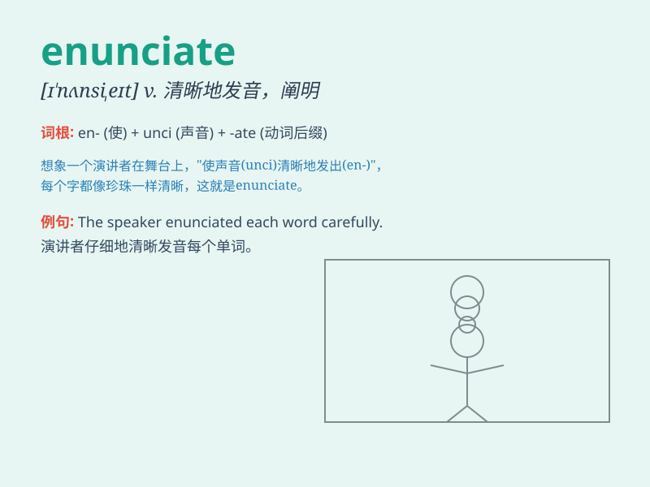

## enunciate

**英音:** _[ɪ\'nʌnsɪeɪt]_ **美音:** _[ɪ\'nʌnsɪet]_

**译义:** *v.阐明,清晰发言*

### 短语

+ **enunciate clearly:** _清晰地阐明_

+ **enunciate precisely:** _精确地表述_

+ **enunciate loudly:** _大声地说出_

+ **enunciate slowly:** _缓慢地发音_

+ **enunciate carefully:** _仔细地表达_

### 例句

#### 例句1

> **The professor enunciated each word clearly during the
lecture.**

**中文翻译:** 教授在讲座中把每个词都清晰地发音。

**单词释义:** 清晰地发音

#### 例句2

> **She enunciated her views on the matter with great confidence.**

**中文翻译:** 她非常自信地阐述了她对这件事的看法。

**单词释义:** 阐述；表明

#### 例句3

> **The actor had difficulty enunciating the complex lines.**

**中文翻译:** 这位演员很难清晰地说出复杂的台词。

**单词释义:** 清晰地说出

### 背诵小故事

> A little bird was singing in the forest. It enunciated each note
clearly and beautifully. People passing by could understand its song
easily. Just like speaking clearly, this is what \'enunciate\' means.

**一只小鸟在森林里唱歌。它清晰而美妙地发出每个音符。路过的人都能轻易听懂它的歌声。就像清晰地说话一样，这就是'enunciate'的意思。**

### 图义

