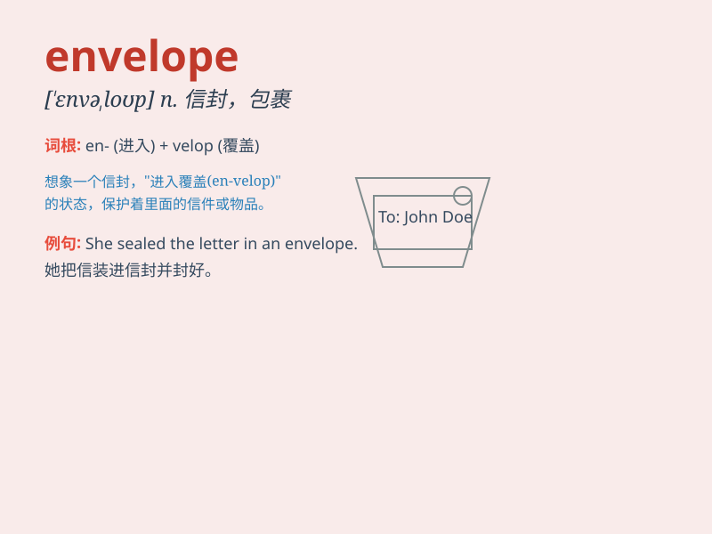

## envelope

**英音:** _[ˈenvələʊp]_ **美音:** _[ˈenvəloʊp]_

**译义:** *n.信封,封套,封袋,[天]包层,[数]包迹,[生]包膜*

### 短语

+ **airmail envelope:** _航空信封_

+ **stamped envelope:** _贴有邮票的信封_

+ **sealed envelope:** _密封的信封_

+ **window envelope:** _开窗信封_

+ **plain envelope:** _普通信封_

### 例句

#### 例句1

> **She sealed the letter and put it in the envelope.**

**中文翻译:** 她把信封口然后放进了信封里。

**单词释义:** 信封

#### 例句2

> **The envelope was made of thick paper.**

**中文翻译:** 这个信封是用厚纸做的。

**单词释义:** 信封

#### 例句3

> **He opened the envelope with excitement.**

**中文翻译:** 他兴奋地打开了信封。

**单词释义:** 信封

### 背诵小故事

> One day, Eve was very nervous. She had a secret letter to send and
needed an ENVELOPE to protect it. She carefully put the letter in the
envelope and sealed it, making sure the secret was safe inside.

**有一天，伊芙非常紧张。她有一封秘密信件要寄，需要一个信封来保护它。她小心地把信放进信封并封好，确保秘密安全地在里面。**

### 图义

