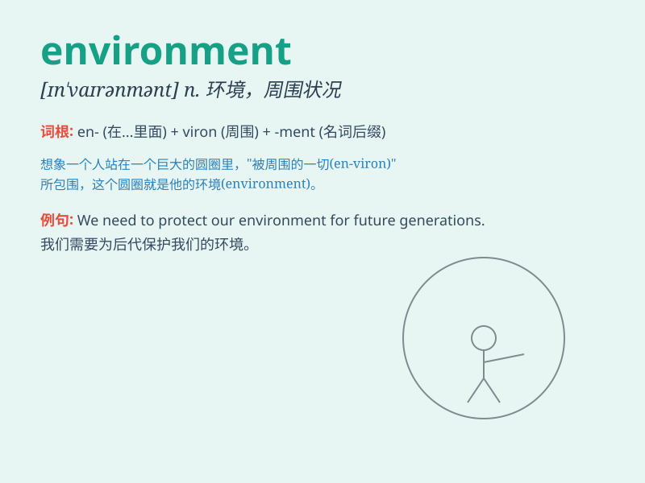

## environment

**英音:** _[ɪnˈvaɪrənmənt]_ **美音:** _[ɪn\'vaɪrənmənt]_

**译义:** *n.环境,外界*

### 短语

+ **environment protection:** _环境保护_

+ **natural environment:** _自然环境_

+ **working environment:** _工作环境_

+ **living environment:** _生活环境_

+ **environment pollution:** _环境污染_

### 例句

#### 例句1

> **We should protect the environment from pollution.**

**中文翻译:** 我们应该保护环境免受污染。

**单词释义:** 环境

#### 例句2

> **The company is committed to creating a sustainable environment
for its employees.**

**中文翻译:** 这家公司致力于为员工创造一个可持续的环境。

**单词释义:** 环境

#### 例句3

> **The changing environment poses new challenges for businesses.**

**中文翻译:** 不断变化的环境给企业带来了新的挑战。

**单词释义:** 环境

### 背诵小故事

> A little fairy was sent to protect the environment. She made the
polluted river clean, grew green trees everywhere, and made the air
fresh. With her efforts, the environment became beautiful and peaceful.

**一个小仙女被派去保护环境。她让被污染的河流变干净，到处种上绿树，让空气变得清新。在她的努力下，环境变得美丽又宁静。**

### 图义

