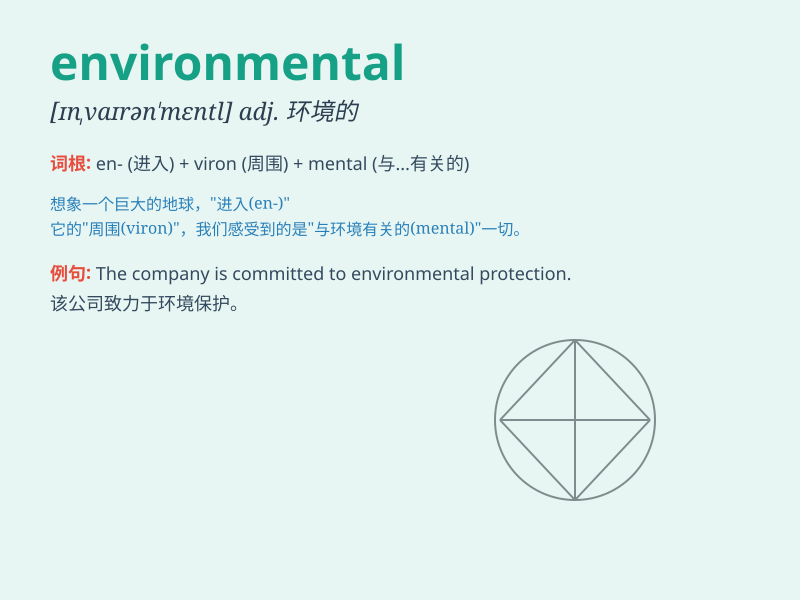

## environmental

**英音:** _[ɪnvaɪrən\'ment(ə)l; en-]_ **美音:**
_[ɪn,vaɪrən\'mɛntl]_

**译义:** *adj.周围的,环境的n.环境论*

### 短语

+ **environmental protection:** _环境保护_

+ **environmental pollution:** _环境污染_

+ **environmental impact:** _环境影响_

+ **environmental awareness:** _环境意识_

+ **environmental science:** _环境科学_

### 例句

#### 例句1

> **We should take measures to protect the environmental quality.**

**中文翻译:** 我们应该采取措施来保护环境质量。

**单词释义:** 环境的；有关环境的

#### 例句2

> **The company is committed to environmental protection.**

**中文翻译:** 这家公司致力于环境保护。

**单词释义:** 环境的；有关环境的

#### 例句3

> **Environmental issues are becoming increasingly serious.**

**中文翻译:** 环境问题正变得越来越严重。

**单词释义:** 环境的

### 背诵小故事

> Imagine a beautiful forest. The clear rivers, the green trees, and
the fresh air. All these make up the environmental scene. We must
protect it to keep our world beautiful and healthy. Environmental means
related to the surroundings.

**想象一个美丽的森林。清澈的河流、绿色的树木和清新的空气。所有这些构成了环境景象。我们必须保护它，以保持我们的世界美丽和健康。Environmental
意思是与环境有关的。**

### 图义

