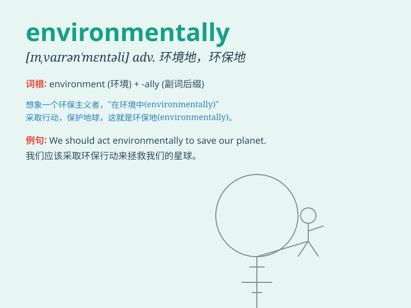

## environmentally

**英音:** _[ɪnˌvaɪrənˈmentəli]_ **美音:**
_[ɪnˌvaɪrənˈmɛntəli]_

**译义:** *adv. 有关环境地，环境保护地*

### 短语

+ **environmentally friendly:** _环保的；对环境无害的_

+ **environmentally sensitive:** _环境敏感的_

+ **environmentally sustainable:** _环境可持续的_

+ **environmentally conscious:** _有环境意识的_

+ **environmentally aware:** _有环境意识的；环保意识强的_

### 例句

#### 例句1

> **We should act environmentally friendly to protect our planet.**

**中文翻译:** 我们应该以环保友好的方式行动来保护我们的星球。

**单词释义:** 以环保的方式

#### 例句2

> **This new product is environmentally sustainable.**

**中文翻译:** 这个新产品是环境可持续的。

**单词释义:** 在环境方面

#### 例句3

> **The company is committed to being environmentally
responsible.**

**中文翻译:** 这家公司致力于对环境负责。

**单词释义:** 在环境方面

### 背诵小故事

> A little fairy was sent to protect the environmentally friendly
forest. She used her magic to keep the air clean and the rivers clear.
\'Environmentally\' means related to the environment and how we protect
it.

**一个小仙女被派去保护环境友好型的森林。她用魔法保持空气清新和河流清澈。'environmentally'意思是与环境以及我们如何保护环境有关。**

### 图义

