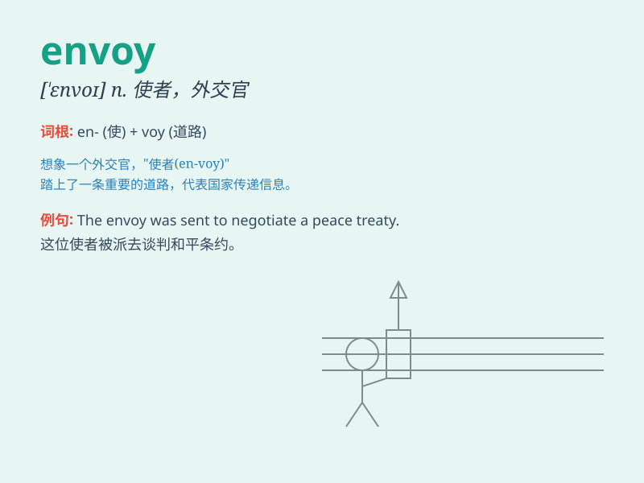

## envoy

**英音:** _[\'envɒɪ]_ **美音:** _[\'ɛnvɔɪ]_

**译义:** *n.外交使节,特使*

### 短语

+ **special envoy:** _特使_

+ **envoy extraordinary:** _特命公使_

+ **trade envoy:** _贸易使节_

+ **diplomatic envoy:** _外交使节_

+ **envoy mission:** _使节使命_

### 例句

#### 例句1

> **The envoy was sent to negotiate a peace treaty.**

**中文翻译:** 这位使者被派去协商和平条约。

**单词释义:** 使者；使节

#### 例句2

> **The government appointed a special envoy to handle the
crisis.**

**中文翻译:** 政府任命了一位特别使者来处理这场危机。

**单词释义:** 特使

#### 例句3

> **The envoy arrived with important messages for the king.**

**中文翻译:** 使者带着给国王的重要消息抵达了。

**单词释义:** 使者；使节

### 背诵小故事

>
国王派遣了一位聪明勇敢的使者（envoy）去邻国商讨重要事务。使者克服重重困难，成功完成使命，为两国带来和平。记住这位肩负重任的使者，就能记住
envoy 这个单词啦。

**国王派遣去邻国的聪明勇敢的使者。记住这个使者的使命，就能记住 envoy
这个单词，意思是使者、使节。**

### 图义

