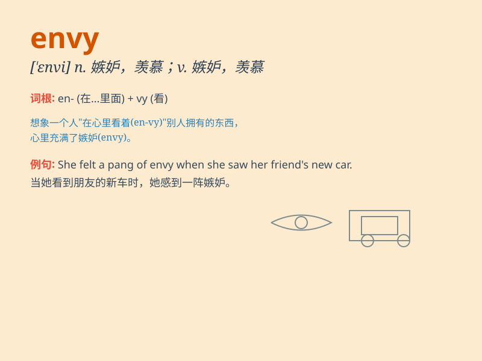

## envy

**英音:** _[\'envɪ]_ **美音:** _[\'ɛnvi]_

**译义:** *n.vt.羡慕,嫉妒*

### 短语

+ **envy at:** _对\...感到羡慕_

+ **envy of:** _羡慕；嫉妒_

+ **fall into envy:** _陷入嫉妒_

+ **be green with envy:** _非常嫉妒_

+ **out of envy:** _出于嫉妒_

### 例句

#### 例句1

> **I envy your success.**

**中文翻译:** 我羡慕你的成功。

**单词释义:** 羡慕

#### 例句2

> **She was filled with envy when she saw her friend\'s new car.**

**中文翻译:** 当她看到朋友的新车时，心中充满了嫉妒。

**单词释义:** 嫉妒

#### 例句3

> **His talent is the envy of all his colleagues.**

**中文翻译:** 他的才华令所有同事羡慕。

**单词释义:** 羡慕；令人羡慕的事物

### 背诵小故事

> There was a poor boy who always envied the rich kids. One day, he saw
them having a big party and felt very sad. But then he realized envy
wouldn\'t change his situation. So he worked hard and finally had a
better life.

**有一个贫穷的男孩总是羡慕富有的孩子。有一天，他看到他们举办盛大的派对，感到非常难过。但随后他意识到羡慕改变不了他的状况。于是他努力工作，最终过上了更好的生活。**

### 图义

