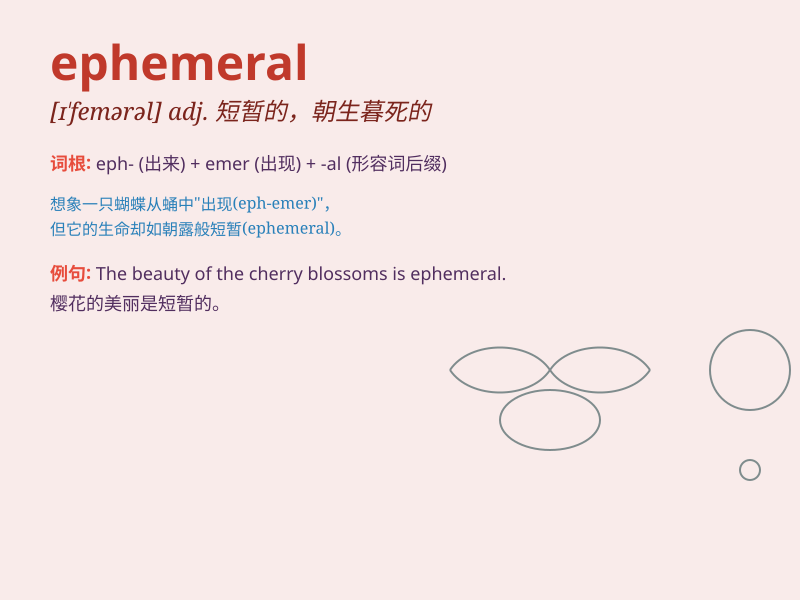

## ephemeral

**英音:** _[ɪ\'fem(ə)r(ə)l; -\'fiːm-]_ **美音:**
_[ə\'fɛmərəl]_

**译义:** *adj.朝生暮死的,短暂的,短命的*

### 短语

+ **ephemeral beauty:** _短暂的美_

+ **ephemeral joy:** _短暂的快乐_

+ **ephemeral moment:** _短暂的时刻_

+ **ephemeral phenomenon:** _短暂的现象_

+ **ephemeral pleasure:** _短暂的愉悦_

### 例句

#### 例句1

> **The beauty of the ephemeral cherry blossoms is captivating.**

**中文翻译:** 短暂的樱花之美令人着迷。

**单词释义:** 短暂的

#### 例句2

> **Fame is often ephemeral in the entertainment industry.**

**中文翻译:** 在娱乐圈中，名声往往是短暂的。

**单词释义:** 短暂的；转瞬即逝的

#### 例句3

> **The ephemeral joy of winning the lottery soon faded.**

**中文翻译:** 中彩票的短暂喜悦很快就消失了。

**单词释义:** 短暂的；昙花一现的

### 背诵小故事

> A beautiful butterfly lived for only a short time. Its life was
ephemeral, like a shooting star in the night sky. It showed us that some
things are wonderful but don\'t last long.

**一只美丽的蝴蝶只存活了很短的时间。它的生命是短暂的，就像夜空中的流星。这向我们展示了有些事物很美好但却不长久。**

### 图义

