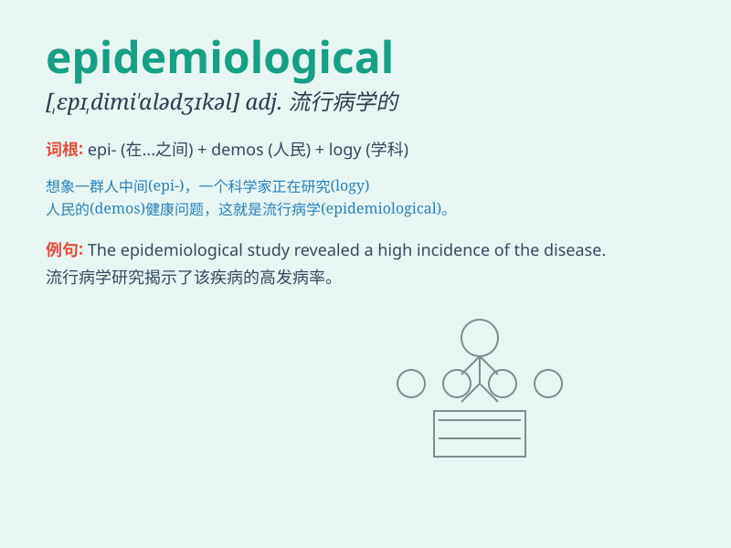

## epidemiological

**英音:** _[ˌepɪˌdiːmiəˈlɒdʒɪkl]_ **美音:**
_[ˌepɪˌdiːmiəˈlɑːdʒɪkl]_

**译义:** *adj.流行病学的*

### 短语

+ **epidemiological study:** _流行病学研究_

+ **epidemiological survey:** _流行病学调查_

+ **epidemiological data:** _流行病学数据_

+ **epidemiological pattern:** _流行病学模式_

+ **epidemiological feature:** _流行病学特征_

### 例句

#### 例句1

> **Epidemiological studies have shown a link between smoking and
lung cancer.**

**中文翻译:** 流行病学研究表明吸烟和肺癌之间存在联系。

**单词释义:** 流行病学的

#### 例句2

> **The epidemiological data collected was crucial for understanding
the disease outbreak.**

**中文翻译:** 收集的流行病学数据对于了解疾病的爆发至关重要。

**单词释义:** 流行病学的

#### 例句3

> **She is an expert in epidemiological research on infectious
diseases.**

**中文翻译:** 她是传染病流行病学研究方面的专家。

**单词释义:** 流行病学的

### 背诵小故事

> In a small town, a strange disease spread. Scientists studied it
using epidemiological methods. They collected data, interviewed people,
and finally found the cause. Remember, epidemiological is about the
study of diseases in a population.

**在一个小镇上，一种奇怪的疾病传播开来。科学家们使用流行病学的方法对其进行研究。他们收集数据、采访民众，最终找到了病因。记住，epidemiological
是关于人群中疾病的研究。**

### 图义

