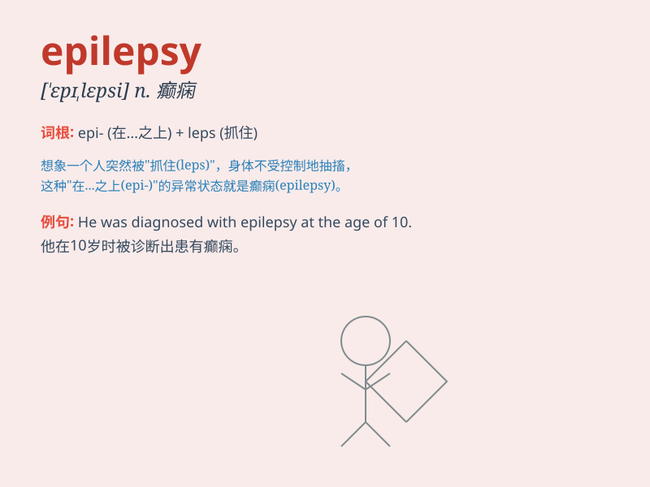

## epilepsy

**英音:** _[\'epɪlepsɪ]_ **美音:** _[\'ɛpə\'lɛpsi]_

**译义:** *n.[医]癫痫症*

### 短语

+ **epilepsy seizure:** _癫痫发作_

+ **idiopathic epilepsy:** _特发性癫痫_

+ **focal epilepsy:** _局灶性癫痫_

+ **refractory epilepsy:** _难治性癫痫_

+ **epilepsy syndrome:** _癫痫综合征_

### 例句

#### 例句1

> **He was diagnosed with epilepsy at the age of five.**

**中文翻译:** 他五岁时被诊断出患有癫痫。

**单词释义:** 癫痫

#### 例句2

> **Epilepsy can cause sudden seizures and loss of consciousness.**

**中文翻译:** 癫痫会导致突然发作和失去意识。

**单词释义:** 癫痫

#### 例句3

> **She has been struggling with epilepsy for many years.**

**中文翻译:** 她与癫痫抗争了很多年。

**单词释义:** 癫痫

### 背诵小故事

> One day, a person suddenly had strange convulsions and lost
consciousness. The doctor diagnosed it as epilepsy. It\'s a disorder
that causes such unexpected and uncontrollable symptoms. Remember,
epilepsy can be managed with proper treatment.

**有一天，一个人突然出现奇怪的抽搐并失去意识。医生诊断为癫痫。这是一种会导致这种意外和无法控制症状的疾病。记住，癫痫通过适当治疗是可以控制的。**

### 图义

