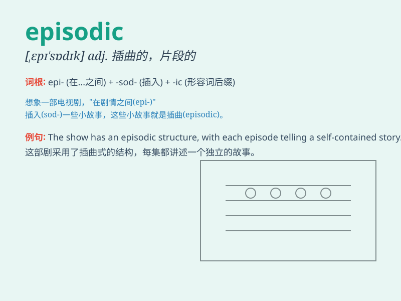

## episodic

**英音:** _[,epɪ\'sɒdɪk]_ **美音:** _[,ɛpɪ\'sɑdɪk]_

**译义:** *adj.插话式的*

### 短语

+ **episodic memory:** _情节记忆_

+ **episodic headache:** _发作性头痛_

+ **episodic narrative:** _情节性叙述_

+ **episodic television:** _情节类电视剧_

+ **episodic disorder:** _发作性疾病_

### 例句

#### 例句1

> **The patient\'s memory problems were episodic, occurring only
occasionally.**

**中文翻译:** 这位病人的记忆问题是间歇性的，只是偶尔发生。

**单词释义:** 间歇性的；偶尔发生的

#### 例句2

> **The show has an episodic format, with each episode telling a
separate story.**

**中文翻译:**
这个节目采用了情节性的形式，每一集都讲述一个独立的故事。

**单词释义:** 由一系列独立部分组成的；情节性的

#### 例句3

> **His career has been rather episodic, with periods of great
success followed by long lulls.**

**中文翻译:**
他的职业生涯相当断断续续，有取得巨大成功的时期，接着是长时间的沉寂。

**单词释义:** 断断续续的；不连贯的

### 背诵小故事

> Imagine a TV show where the adventures of the hero come in separate,
disconnected chunks. That\'s episodic. Each episode has its own story,
not always tied closely to the ones before. Just like this, episodic
means occurring or presented in separate parts or episodes.

**想象一个电视节目，其中主角的冒险是以独立、不连贯的片段呈现的。这就是'episodic（情节不连贯的；偶尔发生的）'。每一集都有自己的故事，不一定与之前的紧密相连。**

### 图义

